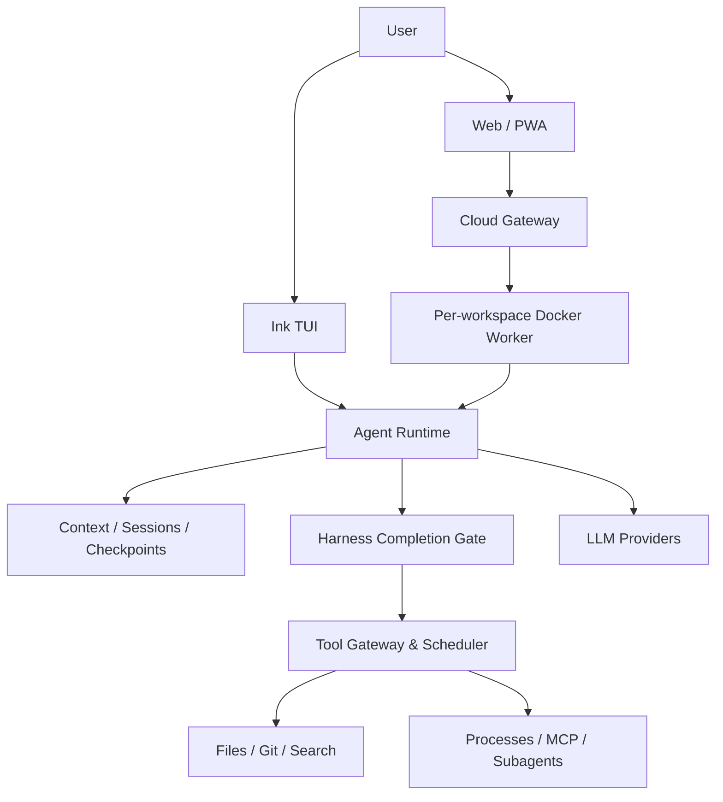

# Kross

**English** | [简体中文](README.zh-CN.md)

[](https://github.com/zzc-101/Kross/actions/workflows/ci.yml)
[](LICENSE)

A local-first, self-hostable coding agent for terminal and Web/PWA workflows. Kross understands project instructions, uses tools to modify code, manages long-running tasks, and keeps users in control before high-risk operations are executed.

> Kross is under active development. The core local TUI and self-hosted Cloud Agent flows are implemented and ready for evaluation and contribution. Cloud deployments should still be validated in a controlled environment for Docker, mobile, reconnect, Push, and Git workflows before production use. No stable release has been published yet.

## Why Kross

Kross is more than a chat interface that forwards prompts to a model. It provides a complete execution loop for real development work:

- **Three working modes**: `auto` solves tasks directly, `plan` asks for plan approval first, and `conductor` delegates work to subagents and reviews the result.
- **Local and cloud workflows**: run the Ink TUI directly on your machine or use the responsive Web/PWA with one isolated Docker Worker per workspace.
- **Verifiable completion contract**: after code changes, Kross checks mutation records and real tool traces for verification evidence. Failed or skipped tests are not presented as success.
- **Stalled-loop protection**: repeated tool calls without progress first trigger a recovery strategy, then stop with a bounded failure report if no progress is possible.
- **Project instruction awareness**: automatically loads `CLAUDE.md`, `AGENTS.md`, and `KROSS.md` from authorized workspace roots.
- **Extensible Skills**: discovers personal and project Skills, loading their instructions and resources only when needed.
- **Safer file mutations**: records a mutation journal before and after writes and provides conflict-protected `/undo`.
- **Recoverable sessions and runs**: messages, context, Todos, mode, pending plans, and pending tool approvals survive restarts without replaying completed writes.
- **Managed background processes**: starts, polls, writes to, and terminates long-running commands with per-session isolation.
- **Controlled tool scheduling**: independent read-only calls may run concurrently, while writes, execution, Process, and MCP calls remain ordered. Polling without progress automatically backs off.
- **Transparent inspection**: `/context`, `/trace`, and `/diff` expose context usage, execution traces, and code changes.
- **Mobile and unreliable-network support**: the Cloud Agent receives events over SSE, submits commands over HTTP, queues offline commands, replays ordered events, sends Web Push approval notifications, and supports PWA installation.
- **Cloud workspace management**: repository cloning, session recovery, real Git Diff, branch Push, Pull Requests, resource limits, and idle reaping.
- **Multiple model providers**: OpenAI, Anthropic, OpenRouter, DeepSeek, and xAI.

## Choose a Runtime

| Runtime | Best for | Additional requirements |
|---|---|---|
| TUI | Local repositories, terminal workflows, and SSH sessions | Node.js and model credentials |
| Cloud Web/PWA | Remote access, mobile devices, and isolated workspaces | Docker Engine and Compose |
| Core/Protocol source extension | Custom hosts, tools, or clients | TypeScript development environment |

Start with the TUI for local use. Deploy Cloud when you need cross-device access or container isolation. To add Skills, MCP servers, custom tools, or clients, read [Extending Kross](docs/extensions.md). The extension guide is currently written in Chinese; English documentation contributions are welcome.

## Quick Start

### Requirements

- Node.js `>= 22.19`
- npm

### Run the Local TUI

The public npm package has not been released yet, so run Kross from source:

```bash
git clone https://github.com/zzc-101/Kross.git
cd Kross
npm install
npm run dev --workspace @kross/tui
```

The planned npm package name is `@zzc-101/kross`, while the installed command remains `kross`. After the first npm release:

```bash
npm install -g @zzc-101/kross
kross
```

The TUI can start without a configured model, but it cannot produce real Agent responses. On first launch, Kross can import detected Claude Code or Codex configuration:

```text
/import claude
/import codex
/import skip
```

You can also configure a model through environment variables. OpenAI example:

```bash
export AGENT_LLM_PROVIDER=openai
export OPENAI_API_KEY=sk-...
export OPENAI_MODEL=gpt-5
npm run dev --workspace @kross/tui
```

Anthropic example:

```bash
export AGENT_LLM_PROVIDER=anthropic
export ANTHROPIC_API_KEY=sk-ant-...
export ANTHROPIC_MODEL=claude-sonnet-4-5
npm run dev --workspace @kross/tui
```

### Run the Self-hosted Cloud Agent

Cloud Agent requires Docker Engine and Docker Compose. On first run, the startup script creates `.env` from `.env.example`, generates an access token, builds the Web, Gateway, and Worker images, and starts them in the background:

```bash
./scripts/start-cloud.sh
```

Open `http://localhost:8787` and sign in with the token printed by the script or stored as `KROSS_ACCESS_TOKEN` in `.env`. Common management commands:

```bash
./scripts/start-cloud.sh --no-build
./scripts/start-cloud.sh --logs
./scripts/start-cloud.sh --stop
```

Public deployments must place a TLS reverse proxy in front of the Web entry point. The Gateway requires access to the Docker Socket, which is effectively a privileged host control plane; deploy it only on a dedicated or otherwise controlled host. See [Cloud deployment and operations](docs/cloud-agent-deployment.md) for configuration, security boundaries, and the acceptance checklist.

## Basic Usage

Describe a task directly:

```text
Review the current branch, fix the regression in the login flow, and run the relevant tests.
```

Review a plan before execution:

```text
/mode plan
Refactor session persistence without changing existing behavior.
/approve
```

Delegate a complex task:

```text
/mode conductor
Review the frontend and backend authentication protocol, implement the changes separately, then verify them together.
```

Work across multiple directories:

```text
/add-dir ~/work/api
/add-dir ~/work/web
/dirs
```

## Common Commands

| Command | Purpose |
|---|---|
| `/mode auto\|plan\|conductor` | Change the Agent working mode |
| `/approve` / `/reject` | Approve or reject a pending plan |
| `/add-dir <path>` / `/dirs` | Add or inspect authorized workspace roots |
| `/resume [sessionId]` | Resume a previous session |
| `/undo [runId\|transactionId]` | Safely revert Agent file mutations |
| `/context` / `/compact` | Inspect or compact model context |
| `/instructions` / `/skills` | Inspect loaded project instructions and Skills |
| `/trace [runId]` / `/diff` | Inspect execution traces and code changes |
| `/processes` | Inspect managed background processes for the current session |
| `/model` / `ctrl+p` | Select the model and thinking effort |
| `/lang zh\|en` | Change the interface language |

## Model Configuration

| Provider | `AGENT_LLM_PROVIDER` | API key | Model |
|---|---|---|---|
| OpenAI | `openai` | `OPENAI_API_KEY` | `OPENAI_MODEL` |
| Anthropic | `anthropic` | `ANTHROPIC_API_KEY` | `ANTHROPIC_MODEL` |
| OpenRouter | `openrouter` | `OPENROUTER_API_KEY` | `OPENROUTER_MODEL` |
| DeepSeek | `deepseek` | `DEEPSEEK_API_KEY` | `DEEPSEEK_MODEL` |
| xAI | `xai` | `XAI_API_KEY` | `XAI_MODEL` |

Configuration saved through `/import` or the model settings UI is stored in `~/.kross/config.json`. Environment variables take precedence over the config file. Each provider also supports its corresponding `*_BASE_URL`.

## Architecture



Kross is a TypeScript monorepo:

- `packages/core`: Agent Runtime, Harness completion gate, context governance, sessions, tools, permissions, Skills, MCP, and model adapters.
- `packages/tui`: Ink-based interactive terminal interface.
- `packages/protocol`: browser-safe Zod wire protocol for commands, events, replay, and session snapshots.
- `packages/server`: authentication, HTTP/SSE Gateway, workspace registry, Docker orchestration, and Web Push.
- `packages/worker`: headless Agent host running inside a workspace container and reusing `packages/core`.
- `packages/web`: responsive React, Vite, and Radix/shadcn Web/PWA client, served by a dedicated Nginx container that proxies Gateway APIs.
- `docs`: user guides, technical architecture, Harness documentation, and release notes.

The Cloud Agent supports streaming sessions, tool and plan approvals, reconnect replay, workspace isolation, session and tool history, Todo progress, subagent state, context usage and manual compaction, Diff/Trace, Web Push, Git Push/PR, resource limits, and idle reaping. The Web client exposes Core commands including `/status`, `/context`, `/compact`, `/instructions`, `/skills`, `/processes`, and `/undo`.

Real deployments should still validate Docker networking, Worker restart recovery, mobile PWA behavior, unreliable networks, Push, and remote Git credentials against the deployment acceptance checklist.

## Documentation

Most detailed documentation is currently in Chinese. English documentation contributions are welcome.

- [Documentation index](docs/README.md)
- [Getting started](docs/getting-started.md)
- [Configuration](docs/configuration.md)
- [Command reference](docs/command-reference.md)
- [Extending Kross](docs/extensions.md)
- [Security model](docs/security.md)
- [Troubleshooting](docs/troubleshooting.md)
- [Technical overview](docs/technical-overview.md)
- [Agent Harness](docs/harness.md)
- [Cloud deployment and operations](docs/cloud-agent-deployment.md)
- [Release guide](docs/releasing.md)
- [Contributing](CONTRIBUTING.md)
- [Security policy](SECURITY.md)

## Security Boundaries

- Read-only operations are allowed by default; writes, execution, and network operations require approval.
- File tools resolve real paths and restrict access to authorized workspaces.
- `/undo` verifies the current file hash and refuses to overwrite later manual changes.
- `Bash` and managed background processes are **not OS-level sandboxes**. Review commands before approving them.
- Cloud Workers use Docker containers as an execution boundary with isolated networks, dropped capabilities, `no-new-privileges`, CPU, memory, PID, and soft disk limits. Containers can still access external networks.
- The Cloud Gateway mounts the Docker Socket by default. Its permissions are equivalent to a privileged host control plane and it must not be exposed directly to the public Internet.
- Scripts referenced by Skills are not executed automatically and still require normal tool approval.

## Development and Verification

```bash
npm run dev --workspace @kross/tui
npm test -- --run
npm run typecheck
npm run docs:check
npm run build
npm run package:check
```

`npm run package:check` bundles the CLI, installs the tarball in a temporary directory, and verifies `kross --help` and `kross --version`.

Run individual Cloud components from their own workspaces:

```bash
npm run dev --workspace @kross/web
npm run dev --workspace @kross/server
npm run dev --workspace @kross/worker
```

The repository root intentionally has no default `dev` script. Each runnable workspace owns its development server, while the root coordinates repository-wide builds, tests, packaging, and Cloud lifecycle commands.

Current gaps include an OS-level sandbox for local execution, MCP resources/prompts and HTTP transport, cross-session semantic memory, nested directory-level Project Instructions, and continued end-to-end validation of Cloud Agent deployments on real Docker, mobile, and public reverse-proxy environments.

## Feedback and Contributing

Use the repository Issue templates for regular bugs and feature requests. Do not disclose security issues publicly; follow the [Security Policy](SECURITY.md) instead. Read [Contributing](CONTRIBUTING.md) before opening a pull request, especially when changing tool permissions, Cloud event replay, persistence, or protocol behavior.
