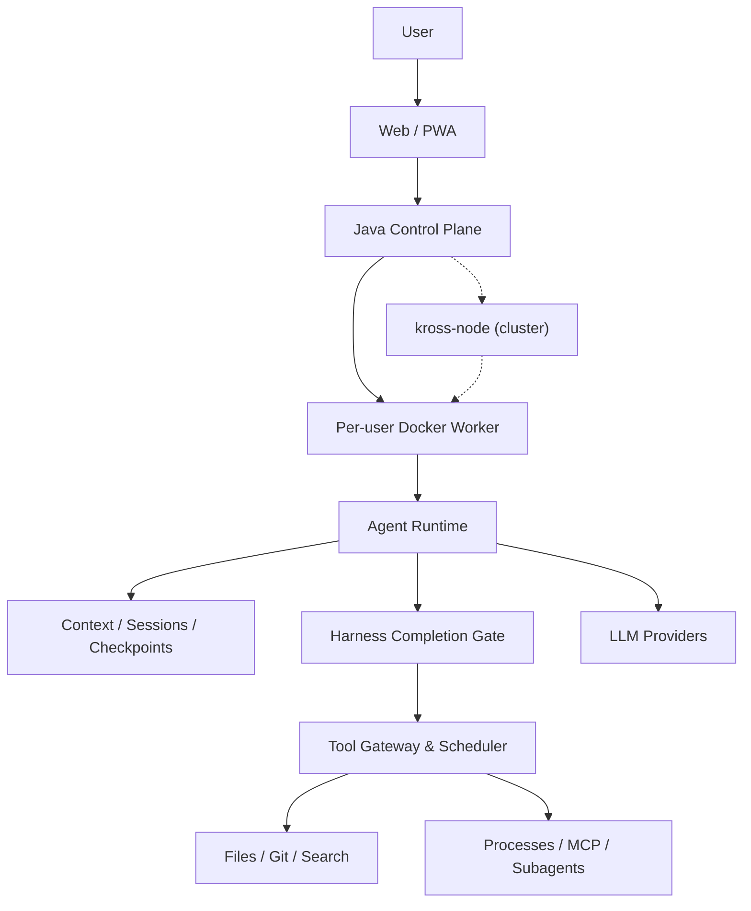

# Kross

**English** | [简体中文](README.zh-CN.md)

[](https://github.com/zzc-101/Kross/actions/workflows/ci.yml)
[](LICENSE)

A self-hostable general-purpose Cloud agent, in the same family as OpenClaw and Hermes. Kross gives each organization member a persistent Agent workspace: a Java control plane, a Web/PWA workbench, and a Docker Worker that runs the same Agent Runtime on a durable volume.

> This branch is Cloud-only. The local Ink TUI and `kross` CLI remain on `main`. Kross is under active development; no stable release has been published yet. Public deployments should still be validated for Docker, mobile, reconnect, Push, and Git workflows.

<p align="center">
  
</p>

## Why Kross

Kross is more than a chat interface that forwards prompts to a model. It is a general agent with a complete execution loop — coding is one of the jobs it can take, not the product definition:

- **Three working modes**: `auto` solves tasks directly, `plan` asks for plan approval first, and `conductor` delegates work to subagents and reviews the result.
- **Persistent per-user workspaces**: one isolated Docker Worker and volume per member; idle containers sleep, the disk stays.
- **Verifiable completion contract**: after code changes, Kross checks mutation records and real tool traces for verification evidence. Failed or skipped tests are not presented as success.
- **Stalled-loop protection**: repeated tool calls without progress first trigger a recovery strategy, then stop with a bounded failure report if no progress is possible.
- **Project instruction awareness**: automatically loads `CLAUDE.md`, `AGENTS.md`, and `KROSS.md` from authorized workspace roots.
- **Extensible Skills**: discovers personal and project Skills, loading their instructions and resources only when needed.
- **Safer file mutations**: records a mutation journal before and after writes and refuses to overwrite later manual changes.
- **Recoverable conversations**: chat history lives in PostgreSQL; tool approvals that are still pending can resume if the evidence is intact. Completed writes are never replayed.
- **Managed background processes**: starts, polls, writes to, and terminates long-running commands with per-session isolation.
- **Controlled tool scheduling**: independent read-only calls may run concurrently, while writes, execution, Process, and MCP calls remain ordered.
- **Live streaming over the control plane**: the browser submits messages over HTTP and receives text, thinking, and tool events over SSE. Workers keep a WebSocket to the control plane only while their container is running.
- **Cloud workspace management**: repository cloning, session recovery, real Git Diff, branch Push, Pull Requests, resource limits, and idle reaping.
- **Native multi-model profiles**: organization admins save named OpenAI, Anthropic, OpenRouter, DeepSeek, and xAI credentials in the admin console.

## Quick Start

Cloud Agent requires Docker Engine and Docker Compose. On first run, the startup script creates `.env` from `.env.example`, generates internal service secrets, builds the Web, Server, and Worker images, and starts them in the background:

```bash
./scripts/start-cloud.sh
```

Open `http://localhost:8787` for the user workbench or `http://localhost:8787/admin/` for the administration console. The first registered user becomes the platform super admin, who can create organizations, assign organization admins, turn self-service registration on or off, and connect an enterprise OIDC IdP (Kross verifies identity and does not issue it). Organization admins onboard members for their own organization. Regular members use the workbench only.

```bash
./scripts/start-cloud.sh --no-build
./scripts/start-cloud.sh --logs
./scripts/start-cloud.sh --stop
```

Public deployments must place a TLS reverse proxy in front of the Web entry. Only the service that starts Worker containers needs the Docker Socket (the control plane on a single host, or `kross-node` in a cluster). See [Cloud deployment and operations](docs/cloud-agent-deployment.md) for configuration, JuiceFS/cluster setup, security boundaries, and the acceptance checklist.

## Basic Usage

Describe a task directly in the workbench:

```text
Review the current workspace, fix the regression in the login flow, and run the relevant tests.
```

Ask for a plan first:

```text
Plan first, then refactor session persistence without changing existing behavior.
```

Ask the agent to split work across subagents:

```text
Split the authentication change into independent tasks, implement them separately, then verify them together.
```

High-risk tools pause in the conversation for an Allow / Reject click. Organization admins add models in the admin console; members do not paste API keys into chat.

## Model Configuration

| Provider | `AGENT_LLM_PROVIDER` | API key | Model |
|---|---|---|---|
| OpenAI | `openai` | `OPENAI_API_KEY` | `OPENAI_MODEL` |
| Anthropic | `anthropic` | `ANTHROPIC_API_KEY` | `ANTHROPIC_MODEL` |
| OpenRouter | `openrouter` | `OPENROUTER_API_KEY` | `OPENROUTER_MODEL` |
| DeepSeek | `deepseek` | `DEEPSEEK_API_KEY` | `DEEPSEEK_MODEL` |
| xAI | `xai` | `XAI_API_KEY` | `XAI_MODEL` |

Kross stores named model profiles in the Java control plane. Environment variables can still seed a provider during local development. Each provider also supports its corresponding `*_BASE_URL`.

<p align="center">
  
</p>

## Architecture


```mermaid
flowchart TB
    U["User"] --> W["Web / PWA"]
    W --> S["Java Control Plane"]
    S --> D["Per-user Docker Worker"]
    S -.-> N["kross-node (cluster)"]
    N -.-> D
    D --> R["Agent Runtime"]
    R --> C["Context / Sessions / Checkpoints"]
    R --> H["Harness Completion Gate"]
    H --> G["Tool Gateway & Scheduler"]
    R --> M["LLM Providers"]
    G --> F["Files / Git / Search"]
    G --> P["Processes / MCP / Subagents"]
```

This branch is a frontend / backend / worker / node layout:

- `frontend/web`: user workbench (React / Vite), served by Nginx and proxied to the Java backend.
- `frontend/admin-web`: organization admin console, served at `/admin/` from the same Nginx.
- `backend`: Java Spring Boot control plane (identity, work, approvals, worker WebSocket, Docker lifecycle).
- `node`: Go process for multi-host workers; it dials the control plane and starts Worker containers locally. Single-host Compose does not run it.
- `worker`: Node executor; Agent Runtime lives in `worker/core`.
- `docs`: user guides, technical architecture, Harness documentation, and release notes.

The browser never talks to the Worker. Inbound chat is `POST /api/v2/agent/conversations/{id}/messages`; live text, thinking, and tool events leave the control plane over SSE. The Worker connects with WebSocket only while its container is running. Conversation history is stored in PostgreSQL as generic message `parts`.

## Documentation

Most detailed documentation is currently in Chinese. English documentation contributions are welcome.

- [Documentation index](docs/README.md)
- [Getting started](docs/getting-started.md)
- [Configuration](docs/configuration.md)
- [Extending Kross](docs/extensions.md)
- [Security model](docs/security.md)
- [Supported environments and compatibility](docs/support.md)
- [Troubleshooting](docs/troubleshooting.md)
- [Technical overview](docs/technical-overview.md)
- [Agent Harness](docs/harness.md)
- [Cloud deployment and operations](docs/cloud-agent-deployment.md)
- [Release guide](docs/releasing.md)
- [Contributing](CONTRIBUTING.md)
- [Security policy](SECURITY.md)

## Security Boundaries

- Read/write tools inside the member workspace are allowed by default on this branch; shell and network calls require an in-chat approval.
- File tools resolve real paths and restrict access to the `/work` workspace.
- Mutation undo verifies the current file hash and refuses to overwrite later manual changes.
- Cloud Workers use Docker containers as an execution boundary with dropped capabilities, `no-new-privileges`, CPU, memory, and PID limits. Containers can still access external networks.
- The process that mounts the Docker Socket has permissions equivalent to a privileged host control plane and must not be exposed directly to the public Internet.
- Scripts referenced by Skills are not executed automatically and still require normal tool approval.

## Development and Verification

```bash
cd frontend && pnpm install && pnpm dev
cd frontend && pnpm dev:admin
cd worker && pnpm install && pnpm dev
cd backend && ./mvnw -DskipTests compile
cd node && go build -o /tmp/kross-node .
node scripts/check-version-consistency.mjs
node scripts/check-doc-links.mjs
```

There is no root Node project. Install dependencies with pnpm in `frontend/` and `worker/` separately. The Java backend uses Maven. Cluster scheduling uses the Go module in `node/`. Start the full Cloud stack with `./scripts/start-cloud.sh`.

Current gaps include MCP interactive OAuth, cross-session semantic memory, nested directory-level Project Instructions, and continued end-to-end validation of Cloud Agent deployments on real Docker, mobile, and public reverse-proxy environments.

## Feedback and Contributing

Use the repository Issue templates for regular bugs and feature requests. Do not disclose security issues publicly; follow the [Security Policy](SECURITY.md) instead. Read [Contributing](CONTRIBUTING.md) before opening a pull request, especially when changing tool permissions, Cloud event replay, persistence, or protocol behavior.
