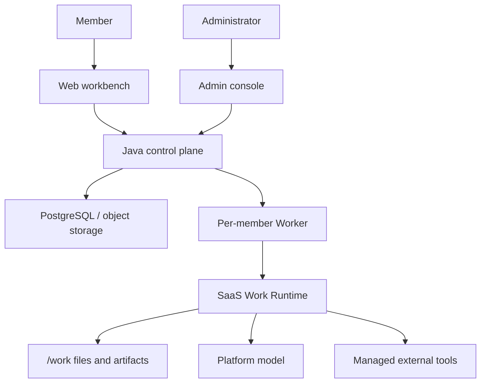

# Kross

**English** | [简体中文](README.zh-CN.md)

[](https://github.com/zzc-101/Kross/actions/workflows/ci.yml)
[](LICENSE)

Kross is a self-hosted SaaS Work Agent for organizations. Each member gets a persistent, isolated workspace where an Agent can organize files, create work products, remember durable preferences, use platform-managed Skills, and call managed external tools when needed.

Kross is a Web product. It does not ship or preserve a terminal UI, local CLI, coding-agent modes, repository management, or user-selectable permission profiles.

## Product model

- One long-lived workspace and Docker Worker per member.
- One automatic work loop; users describe outcomes instead of choosing execution modes.
- Platform-managed model profiles and versioned Skills.
- Durable conversations in PostgreSQL and durable files under `/work`.
- Personal memory synchronized into `USER.md` and `MEMORY.md`.
- Workspace file operations run without repeated prompts; external services require a clear confirmation.
- Task results are expressed as artifacts, evidence, and incomplete items.
- HTTP input, SSE streaming to the browser, and a Worker WebSocket behind the control plane.

## Quick start

Requirements: Docker Engine and Docker Compose v2.

```bash
./scripts/start-cloud.sh
```

Open the workbench at `http://localhost:8787` and administration at `http://localhost:8787/admin/`. The first registered account becomes the platform super administrator. Configure an enabled model, create an organization, and onboard members before starting normal work.

```bash
./scripts/start-cloud.sh --no-build
./scripts/start-cloud.sh --logs
./scripts/start-cloud.sh --stop
```

Public deployments need TLS in front of the Web entry. Only the control-plane component responsible for starting Workers may access the Docker Socket. See [deployment and operations](docs/cloud-agent-deployment.md).

## Using Kross

Describe the desired result directly:

```text
Read the files in my workspace, summarize the customer feedback, and create an action-plan document.
```

The workbench provides conversations, installed Skills, personal memory, and generated files. The platform chooses the model. A confirmation appears only before a managed tool accesses or modifies an external system.

## Architecture


```mermaid
flowchart TB
    U["Member"] --> WEB["Web workbench"]
    A["Administrator"] --> ADMIN["Admin console"]
    WEB --> CP["Java control plane"]
    ADMIN --> CP
    CP --> DB["PostgreSQL / object storage"]
    CP --> W["Per-member Worker"]
    W --> R["SaaS Work Runtime"]
    R --> FS["/work files and artifacts"]
    R --> LLM["Platform model"]
    R --> EXT["Managed external tools"]
```

The browser never connects directly to a Worker. The control plane owns identity, organizations, conversations, model credentials, Skill versions, streaming, and Worker lifecycle. The Worker owns the Agent loop and member workspace.

## Repository layout

- `frontend/web`: member workbench.
- `frontend/admin-web`: platform and organization administration.
- `backend`: Spring Boot control plane.
- `worker`: Node.js container runtime; Agent Core is under `worker/core`.
- `deploy/local`: Docker Compose and images for single-host.
- `deploy/cluster`: Helm chart for k3s.
- `docs`: operations, architecture, protocol, and security guides.

## Development

Source-development baselines are Node.js `>= 22.19.0`, Java 21, and pnpm `10.14`.

```bash
cd frontend && pnpm typecheck && pnpm test && pnpm build
cd worker && pnpm typecheck && pnpm test && pnpm build
cd backend && ./mvnw test
node scripts/check-version-consistency.mjs
node scripts/check-doc-links.mjs
```

The repository root is not a Node project. Install frontend and Worker dependencies separately.

## Documentation

- [Documentation index](docs/README.md)
- [Getting started](docs/getting-started.md)
- [Configuration](docs/configuration.md)
- [Technical overview](docs/technical-overview.md)
- [Security model](docs/security.md)
- [Cloud protocol](docs/cloud-protocol.md)
- [Troubleshooting](docs/troubleshooting.md)
- [Contributing](CONTRIBUTING.md)
- [Security policy](SECURITY.md)
