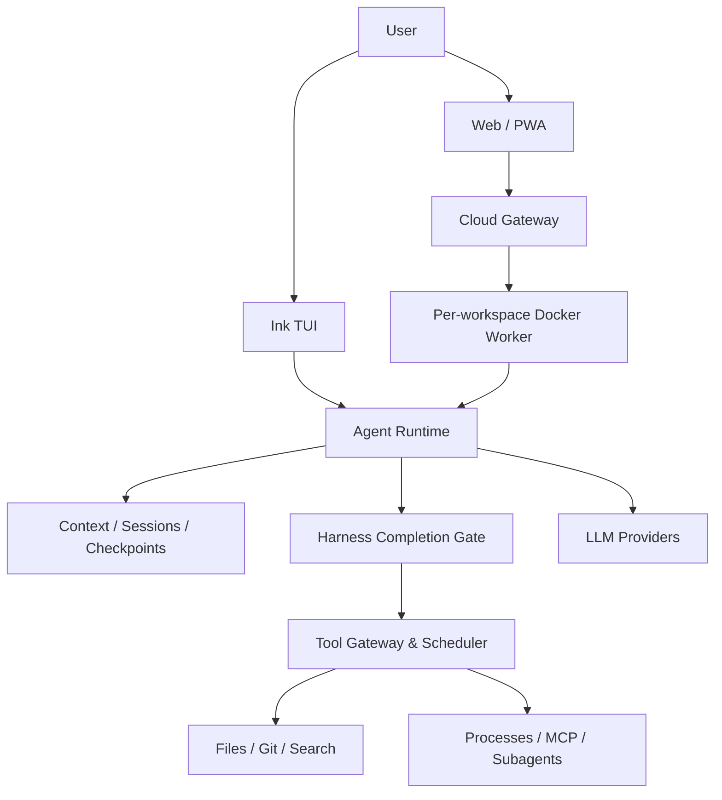

# Kross

[English](README.md) | **简体中文**

[](https://github.com/zzc-101/Kross/actions/workflows/ci.yml)
[](LICENSE)

本地优先、可自托管的编程 Agent：既可以在终端中直接运行，也可以通过响应式 Web/PWA 连接隔离的云端工作区。Kross 能理解项目规则、调用工具修改代码、管理长任务，并在真正执行高风险操作前保留你的控制权。

> Kross 正在积极开发中。本地 TUI 与自托管 Cloud Agent 的核心流程已经实现，当前适合试用、功能验证和参与开发；云端部署仍建议先在受控环境完成 Docker、移动端、断线恢复、Push 和 Git 流程验收，尚未发布稳定版本。

## 为什么是 Kross

Kross 不只是一个把提示词转发给模型的聊天界面。它围绕真实开发任务提供完整运行闭环：

- **三种工作模式**：`auto` 直接解决问题，`plan` 先确认计划，`conductor` 拆分任务并交给子代理执行、复核。
- **本地与云端双形态**：使用 Ink TUI 在本机直接工作，或通过响应式 Web/PWA 访问每工作区独立的 Docker Worker。
- **可验证的完成契约**：代码修改后根据 mutation 与真实工具 trace 检查验证证据；测试失败或未运行时不会伪装成成功。
- **抗空转工具循环**：重复调用无进展时先引导模型恢复策略，仍然停滞则有限退出并报告阻塞。
- **项目规则感知**：自动加载 workspace 根目录中的 `CLAUDE.md`、`AGENTS.md` 和 `KROSS.md`。
- **可扩展 Skills**：发现个人与项目 Skills，只在需要时安全读取正文和资源。
- **安全文件修改**：写入前后记录 mutation journal，支持带冲突保护的 `/undo`。
- **可恢复会话与运行**：消息、上下文、Todo、当前模式、待确认计划和未执行的工具审批可跨重启安全恢复，已完成写操作不会重放。
- **可管理后台进程**：启动、轮询、输入和终止长时间运行的命令，并按会话隔离进程。
- **受控工具调度**：独立只读调用可并发执行，写入、执行、Process 和 MCP 调用保持有序；无进展轮询会自动退避。
- **透明可调试**：通过 `/context`、`/trace` 和 `/diff` 查看上下文、执行轨迹与代码变更。
- **弱网与移动端支持**：Cloud Agent 使用 SSE 接收事件、HTTP 提交命令，支持断线排队、按序回放、Web Push 审批通知和 PWA 安装。
- **云端工作区管理**：支持仓库克隆、会话恢复、真实 Git Diff、分支 Push、Pull Request、资源限额与空闲回收。
- **多模型支持**：兼容 OpenAI、Anthropic、OpenRouter、DeepSeek 和 xAI。

## 选择运行方式

| 方式 | 适合场景 | 额外要求 |
|---|---|---|
| TUI | 本机仓库、终端工作流、SSH 环境 | Node.js 与模型凭证 |
| Cloud Web/PWA | 远程访问、移动端、隔离工作区 | Docker Engine 与 Compose |
| Core/Protocol 源码扩展 | 自定义宿主、工具或客户端 | TypeScript 开发环境 |

第一次使用建议从 TUI 开始；需要跨设备访问或容器隔离时再部署 Cloud。希望接入
Skills、MCP、自定义工具或客户端时，先阅读[扩展 Kross](docs/extensions.md)。

## 快速开始

### 环境要求

- Node.js `>= 22.19`
- npm

### 启动本地 TUI

当前公开版本尚未推送到 npm，请先从源码运行：

```bash
git clone https://github.com/zzc-101/Kross.git
cd Kross
npm install
npm run dev --workspace @kross/tui
```

仓库中的发布包名为 `@zzc-101/kross`，安装后的命令保持为 `kross`。首个 npm 版本发布后可使用：

```bash
npm install -g @zzc-101/kross
kross
```

没有配置模型时也可以启动 TUI，但无法获得真实的 Agent 回复。首次启动若检测到 Claude Code 或 Codex 配置，可直接在 Kross 中导入：

```text
/import claude
/import codex
/import skip
```

也可以通过环境变量配置模型。例如使用 OpenAI：

```bash
export AGENT_LLM_PROVIDER=openai
export OPENAI_API_KEY=sk-...
export OPENAI_MODEL=gpt-5
npm run dev --workspace @kross/tui
```

使用 Anthropic：

```bash
export AGENT_LLM_PROVIDER=anthropic
export ANTHROPIC_API_KEY=sk-ant-...
export ANTHROPIC_MODEL=claude-sonnet-4-5
npm run dev --workspace @kross/tui
```

### 启动自托管 Cloud Agent

Cloud Agent 需要 Docker Engine 和 Docker Compose。首次启动会根据 `.env.example`
创建 `.env`、生成访问令牌、构建 Web、Gateway 与 Worker 镜像并在后台启动：

```bash
./scripts/start-cloud.sh
```

启动后访问 `http://localhost:8787`，使用脚本输出或 `.env` 中的
`KROSS_ACCESS_TOKEN` 登录。常用管理命令：

```bash
./scripts/start-cloud.sh --no-build
./scripts/start-cloud.sh --logs
./scripts/start-cloud.sh --stop
```

公网部署必须在 Gateway 前配置 TLS 反向代理。Gateway 需要访问 Docker Socket，
该权限近似宿主机 root 权限，建议部署在专用主机或其他受控环境。完整配置、安全
边界和验收步骤见[云端部署与运维](docs/cloud-agent-deployment.md)。

## 基本使用

启动后直接描述任务即可：

```text
检查当前分支的改动，修复登录流程中的回归，并运行相关测试。
```

需要先审阅计划时：

```text
/mode plan
重构会话持久化模块，保持现有行为不变。
/approve
```

需要拆分复杂任务时：

```text
/mode conductor
梳理前后端认证协议，分别完成修改，最后统一验证。
```

跨目录工作与模式相互独立：

```text
/add-dir ~/work/api
/add-dir ~/work/web
/dirs
```

## 常用命令

| 命令 | 用途 |
|---|---|
| `/mode auto\|plan\|conductor` | 切换 Agent 工作模式 |
| `/approve` / `/reject` | 批准或拒绝待执行计划 |
| `/add-dir <path>` / `/dirs` | 添加或查看 workspace roots |
| `/resume [sessionId]` | 恢复历史会话 |
| `/undo [runId\|transactionId]` | 安全撤销 Agent 文件修改 |
| `/context` / `/compact` | 检查或压缩模型上下文 |
| `/instructions` / `/skills` | 查看已加载的项目规则和 Skills |
| `/trace [runId]` / `/diff` | 检查执行轨迹和代码变更 |
| `/processes` | 查看当前会话管理的后台进程 |
| `/model` / `ctrl+p` | 选择模型和思考强度 |
| `/lang zh\|en` | 切换界面语言 |

## 模型配置

| Provider | `AGENT_LLM_PROVIDER` | API Key | Model |
|---|---|---|---|
| OpenAI | `openai` | `OPENAI_API_KEY` | `OPENAI_MODEL` |
| Anthropic | `anthropic` | `ANTHROPIC_API_KEY` | `ANTHROPIC_MODEL` |
| OpenRouter | `openrouter` | `OPENROUTER_API_KEY` | `OPENROUTER_MODEL` |
| DeepSeek | `deepseek` | `DEEPSEEK_API_KEY` | `DEEPSEEK_MODEL` |
| xAI | `xai` | `XAI_API_KEY` | `XAI_MODEL` |

通过 `/import` 或模型设置保存的配置位于 `~/.kross/config.json`。环境变量优先于配置文件；各 Provider 也支持对应的 `*_BASE_URL`。

## 核心设计



仓库采用 TypeScript monorepo：

- `packages/core`：Agent runtime、Harness 完成门、上下文治理、会话、工具、权限、Skills、MCP 与模型适配。
- `packages/tui`：基于 Ink 的交互式终端界面。
- `packages/protocol`：浏览器安全的 Zod 线协议，定义命令、事件、回放和会话快照。
- `packages/server`：认证、HTTP/SSE 网关、工作区注册、Docker 编排与 Web Push。
- `packages/worker`：运行在工作区容器内的 headless Agent 宿主，复用 `packages/core`。
- `packages/web`：基于 React、Vite 和 Radix/shadcn 的响应式 Web/PWA 客户端，由独立 Nginx 容器托管并反代 Gateway API。
- `docs`：用户指南、技术概览、Harness 说明和发布文档。

Cloud Agent 当前支持流式会话、工具与计划审批、断线回放、工作区隔离、会话与
工具历史、Todo 进度、子代理状态、上下文容量与手动压缩、Diff/Trace、Web Push、
Git Push/PR、资源限额和空闲回收。Web
端也可通过 `/status`、`/context`、`/compact`、`/instructions`、`/skills`、
`/processes` 和 `/undo` 调用相应 Core 能力。真实部署仍应按验收清单检查 Docker
网络、Worker 重启恢复、移动端 PWA、弱网、Push 和远端 Git 凭证流程。

## 文档

- [文档导航](docs/README.md)
- [快速上手](docs/getting-started.md)
- [配置参考](docs/configuration.md)
- [命令手册](docs/command-reference.md)
- [扩展 Kross](docs/extensions.md)
- [安全模型](docs/security.md)
- [故障排查](docs/troubleshooting.md)
- [技术概览](docs/technical-overview.md)
- [Agent Harness](docs/harness.md)
- [Cloud Agent 部署与运维](docs/cloud-agent-deployment.md)
- [发布指南](docs/releasing.md)
- [参与贡献](CONTRIBUTING.md)
- [漏洞报告](SECURITY.md)

## 安全边界

- 默认只自动允许读操作；写入、执行和网络操作需要审批。
- 文件工具使用真实路径校验，限制在已授权 workspace 内。
- `/undo` 会验证当前文件 hash，检测到人工后续修改时拒绝覆盖。
- `Bash` 和后台进程工具目前**不是 OS 级沙箱**。批准命令前仍应确认其影响范围。
- Cloud Worker 以 Docker 容器作为执行边界，并使用独立网络、能力丢弃、`no-new-privileges`、CPU、内存、PID 与磁盘软限额；容器仍可访问外网。
- Cloud Gateway 默认挂载 Docker Socket，其权限等价于宿主机高权限控制面，不能直接暴露到公网。
- Skills 中的脚本不会自动执行；执行仍需经过工具审批。

## 开发与验证

```bash
npm run dev --workspace @kross/tui
npm test -- --run
npm run typecheck
npm run docs:check
npm run build
npm run package:check
```

`npm run package:check` 会打包并在临时目录真实安装 CLI，然后验证 `kross --help` 和 `kross --version`。

Cloud 各组件单独开发可使用：

```bash
npm run dev --workspace @kross/web
npm run dev --workspace @kross/server
npm run dev --workspace @kross/worker
```

根目录不再提供默认 `dev` 入口。开发服务器由对应 workspace 自己管理，避免根包
隐式绑定到某一种产品形态。

当前主要待补能力包括本地运行的 OS 级执行沙箱、MCP resources/prompts 与 HTTP
transport、跨会话语义记忆、嵌套目录级 Project Instructions，以及 Cloud Agent
在真实 Docker、移动端和公网反向代理环境中的持续端到端验收。

## 反馈与贡献

普通缺陷和功能建议请使用仓库的 Issue 模板；安全问题不要公开披露，请按
[安全策略](SECURITY.md)私密报告。准备贡献代码前阅读[参与贡献](CONTRIBUTING.md)，
尤其注意工具权限、Cloud 事件重放和持久化兼容性。
