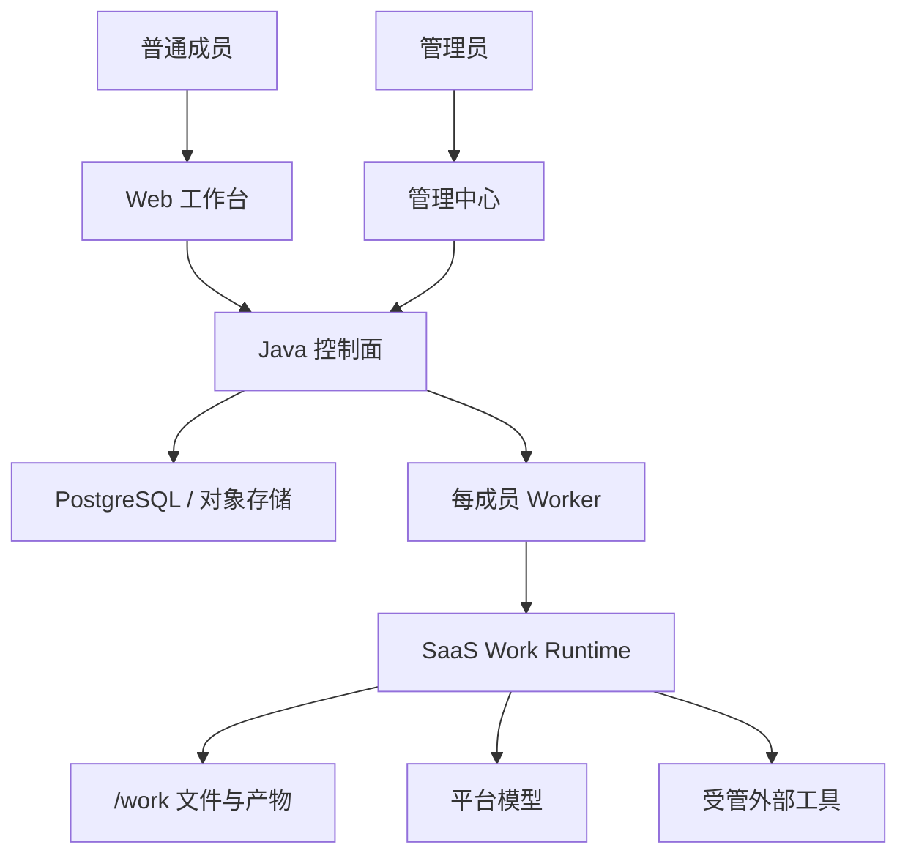

# Kross

[English](README.md) | **简体中文**

[](https://github.com/zzc-101/Kross/actions/workflows/ci.yml)
[](LICENSE)

Kross 是面向组织的可自托管 SaaS Work Agent。每位成员拥有长期、隔离的工作区，Agent 可以整理资料、创建工作产物、记住长期偏好、使用平台版本化 Skill，并在需要时调用受管外部工具。

Kross 是 Web 产品，不发布或兼容终端 UI、本地 CLI、编程 Agent 运行模式、仓库管理和用户可选权限档位。

## 产品模型

- 每位成员一个长期工作区和独立 Docker Worker。
- 只有自动工作闭环；用户描述目标，不选择运行模式。
- 模型档案和版本化 Skill 由平台管理。
- 对话持久化在 PostgreSQL，文件和产物持久化在 `/work`。
- 个人偏好与事实同步到 `USER.md` 和 `MEMORY.md`。
- 工作区文件操作不反复打断用户；访问或修改外部系统前明确确认。
- 任务结果统一为产物、证据和未完成项。
- 浏览器通过 HTTP 发消息、SSE 接收直播；Worker 只在控制面后保持 WebSocket。

## 快速开始

需要 Docker Engine 和 Docker Compose v2：

```bash
./scripts/start-cloud.sh
```

工作台位于 `http://localhost:8787`，管理中心位于 `http://localhost:8787/admin/`。第一个注册账号会成为平台超级管理员。先配置可用模型、创建组织并为成员开通权限，再开始正常工作。

```bash
./scripts/start-cloud.sh --no-build
./scripts/start-cloud.sh --logs
./scripts/start-cloud.sh --stop
```

公网部署必须在 Web 入口前配置 TLS。只有负责启动 Worker 的控制面组件可以访问 Docker Socket。细节见[部署与运维](docs/cloud-agent-deployment.md)。

## 使用方式

直接描述期望结果：

```text
读取工作区里的客户反馈，提炼主要问题，并生成一份下一步行动文档。
```

工作台提供对话、已安装 Skill、个人记忆、文件与产物。模型由平台选择。只有受管工具将访问或修改外部系统时，工作台才显示确认面板。

## 架构


```mermaid
flowchart TB
    U["普通成员"] --> WEB["Web 工作台"]
    A["管理员"] --> ADMIN["管理中心"]
    WEB --> CP["Java 控制面"]
    ADMIN --> CP
    CP --> DB["PostgreSQL / 对象存储"]
    CP --> W["每成员 Worker"]
    W --> R["SaaS Work Runtime"]
    R --> FS["/work 文件与产物"]
    R --> LLM["平台模型"]
    R --> EXT["受管外部工具"]
```

浏览器不直连 Worker。控制面负责身份、组织、对话、模型凭证、Skill 版本、直播和 Worker 生命周期；Worker 负责 Agent 闭环和成员工作区。

## 目录

- `frontend/web`：普通成员工作台。
- `frontend/admin-web`：平台与组织管理中心。
- `backend`：Spring Boot 控制面。
- `worker`：Node.js 容器运行时，Agent Core 位于 `worker/core`。
- `deploy/local`：单机 Docker Compose 与镜像。
- `deploy/cluster`：k3s Helm chart。
- `docs`：运维、架构、协议与安全文档。

## 开发

源码开发基线为 Node.js `>= 22.19.0`、Java 21 与 pnpm `10.14`。

```bash
cd frontend && pnpm typecheck && pnpm test && pnpm build
cd worker && pnpm typecheck && pnpm test && pnpm build
cd backend && ./mvnw test
node scripts/check-version-consistency.mjs
node scripts/check-doc-links.mjs
```

根目录不是 Node 项目，前端与 Worker 分别安装依赖。

## 文档

- [文档索引](docs/README.md)
- [快速上手](docs/getting-started.md)
- [配置参考](docs/configuration.md)
- [技术概览](docs/technical-overview.md)
- [安全模型](docs/security.md)
- [Cloud Protocol](docs/cloud-protocol.md)
- [故障排查](docs/troubleshooting.md)
- [参与贡献](CONTRIBUTING.md)
- [安全政策](SECURITY.md)
