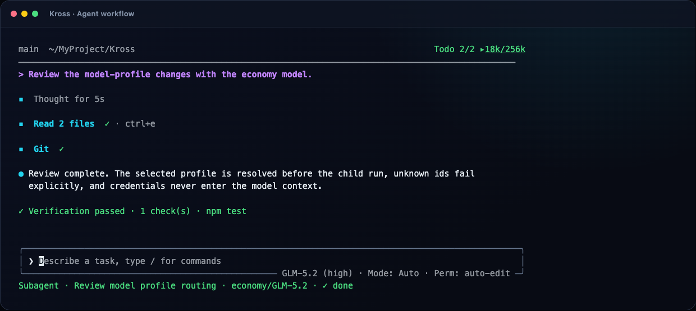
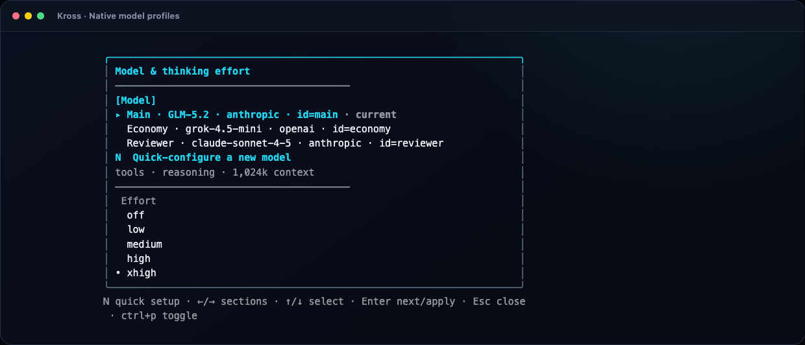
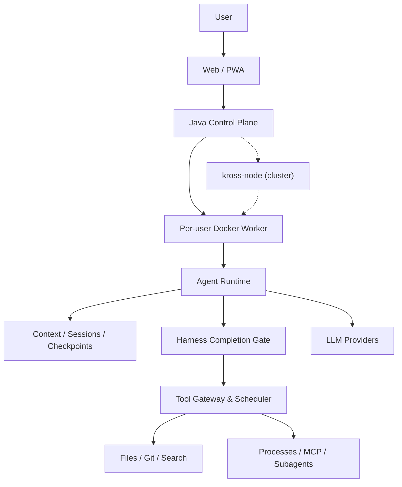

# Kross

[English](README.md) | **简体中文**

[](https://github.com/zzc-101/Kross/actions/workflows/ci.yml)
[](LICENSE)

可自托管的通用 Cloud Agent，定位接近 OpenClaw、Hermes：给组织里的每位成员一块长期 Agent 工作区。Java 控制面、Web/PWA 工作台，以及在持久卷上运行同一套 Agent Runtime 的 Docker Worker。

> 本分支是 Cloud-only。本地 Ink TUI 和 `kross` CLI 仍保留在 `main`。Kross 正在积极开发中，尚未发布稳定版本；公网部署前仍建议先在受控环境完成 Docker、移动端、断线恢复、Push 和 Git 流程验收。

<p align="center">
  
</p>

## 为什么是 Kross

Kross 不只是一个把提示词转发给模型的聊天界面。它是带完整运行闭环的通用 Agent：写代码、查资料、跑命令、管文件都可以，编程只是其中一类任务，不是产品定义：

- **三种工作模式**：`auto` 直接解决问题，`plan` 先确认计划，`conductor` 拆分任务并交给子代理执行、复核。
- **每人一块持久工作区**：每成员独立 Docker Worker 与数据卷；空闲时容器休眠，磁盘留下。
- **可验证的完成契约**：代码修改后根据 mutation 与真实工具 trace 检查验证证据；测试失败或未运行时不会伪装成成功。
- **抗空转工具循环**：重复调用无进展时先引导模型恢复策略，仍然停滞则有限退出并报告阻塞。
- **项目规则感知**：自动加载 workspace 根目录中的 `CLAUDE.md`、`AGENTS.md` 和 `KROSS.md`。
- **可扩展 Skills**：发现个人与项目 Skills，只在需要时安全读取正文和资源。
- **安全文件修改**：写入前后记录 mutation journal，检测到人工后续修改时拒绝覆盖。
- **可恢复对话**：聊天历史在 PostgreSQL；证据完整的待审批工具可以继续，已完成写操作不会重放。
- **可管理后台进程**：启动、轮询、输入和终止长时间运行的命令，并按会话隔离进程。
- **受控工具调度**：独立只读调用可并发执行，写入、执行、Process 和 MCP 调用保持有序。
- **经控制面直播**：浏览器用 HTTP 提交消息，用 SSE 接收文本、思考和工具事件；Worker 仅在容器运行时与控制面保持 WebSocket。
- **云端工作区管理**：支持仓库克隆、会话恢复、真实 Git Diff、分支 Push、Pull Request、资源限额与空闲回收。
- **原生多模型档案**：组织管理员在管理中心保存、命名多个 OpenAI、Anthropic、OpenRouter、DeepSeek 和 xAI 配置。

## 快速开始

Cloud Agent 需要 Docker Engine 和 Docker Compose。首次运行时，启动脚本会从 `.env.example` 创建 `.env`、生成内部服务密钥、构建 Web、控制面和 Worker 镜像，并在后台启动：

```bash
./scripts/start-cloud.sh
```

打开 `http://localhost:8787` 进入用户工作台，或打开 `http://localhost:8787/admin/` 进入管理中心。第一个注册的用户会成为平台超级管理员，可以创建组织、指定组织管理员、控制自助注册，并接入企业 OIDC SSO（Kross 只做验证方）。组织管理员负责本组织入职。普通成员只使用工作台。常用管理命令：

```bash
./scripts/start-cloud.sh --no-build
./scripts/start-cloud.sh --logs
./scripts/start-cloud.sh --stop
```

公网部署必须在 Web 入口前放置 TLS 反向代理。只有负责拉起 Worker 容器的进程需要 Docker Socket（单机是控制面，集群是 `kross-node`）。配置、JuiceFS/多机、安全边界和验收清单见 [Cloud Agent 部署与运维](docs/cloud-agent-deployment.md)。

## 基本用法

在工作台直接描述任务：

```text
Review the current workspace, fix the regression in the login flow, and run the relevant tests.
```

先要计划：

```text
先做计划，再重构会话持久化，不要改变现有行为。
```

让 Agent 拆分任务：

```text
把认证改造拆成独立任务，分别实现后再统一验收。
```

高风险工具会在对话里暂停，点「允许一次」或「拒绝」。组织管理员在管理中心添加模型，成员不要把 API Key 贴进聊天。

## 模型配置

| Provider | `AGENT_LLM_PROVIDER` | API key | Model |
|---|---|---|---|
| OpenAI | `openai` | `OPENAI_API_KEY` | `OPENAI_MODEL` |
| Anthropic | `anthropic` | `ANTHROPIC_API_KEY` | `ANTHROPIC_MODEL` |
| OpenRouter | `openrouter` | `OPENROUTER_API_KEY` | `OPENROUTER_MODEL` |
| DeepSeek | `deepseek` | `DEEPSEEK_API_KEY` | `DEEPSEEK_MODEL` |
| xAI | `xai` | `XAI_API_KEY` | `XAI_MODEL` |

Kross 把命名模型档案保存在 Java 控制面。本地开发仍可用环境变量注入 Provider。每个 Provider 也支持对应的 `*_BASE_URL`。

<p align="center">
  
</p>

## 架构


```mermaid
flowchart TB
    U["User"] --> W["Web / PWA"]
    W --> S["Java Control Plane"]
    S --> D["Per-user Docker Worker"]
    S -.-> N["kross-node (cluster)"]
    N -.-> D
    D --> R["Agent Runtime"]
    R --> C["Context / Sessions / Checkpoints"]
    R --> H["Harness Completion Gate"]
    H --> G["Tool Gateway & Scheduler"]
    R --> M["LLM Providers"]
    G --> F["Files / Git / Search"]
    G --> P["Processes / MCP / Subagents"]
```

本分支按前端 / 后端 / Worker / 节点分开：

- `frontend/web`：用户工作台（React / Vite），由 Nginx 提供并反代到 Java 后端。
- `frontend/admin-web`：组织管理控制台，由同一 Nginx 挂在 `/admin/`。
- `backend`：Java Spring Boot 控制面（身份、工作、审批、Worker WebSocket、Docker 生命周期）。
- `node`：多机时的 Go 节点进程，出站连控制面并在本机起 Worker；单机 Compose 不跑它。
- `worker`：Node 执行器；Agent Runtime 在 `worker/core`。
- `docs`：用户指南、技术架构、Harness 文档和发布说明。

浏览器不直连 Worker。入站聊天走 `POST /api/v2/agent/conversations/{id}/messages`；文本、思考和工具直播经控制面 SSE 发出。Worker 只在容器运行时保持 WebSocket。对话历史以通用消息 `parts` 写入 PostgreSQL。

## 文档

详细文档目前以中文为主，欢迎补充英文文档。

- [文档索引](docs/README.md)
- [快速上手](docs/getting-started.md)
- [配置参考](docs/configuration.md)
- [扩展 Kross](docs/extensions.md)
- [安全模型](docs/security.md)
- [支持范围与兼容策略](docs/support.md)
- [故障排查](docs/troubleshooting.md)
- [技术概览](docs/technical-overview.md)
- [Agent Harness](docs/harness.md)
- [Cloud Agent 部署与运维](docs/cloud-agent-deployment.md)
- [发布指南](docs/releasing.md)
- [参与贡献](CONTRIBUTING.md)
- [漏洞报告](SECURITY.md)

## 安全边界

- `default` 仅自动允许读取；本分支 Cloud Worker 固定 `classifier`（工作区内可信编辑自动允许，Shell 与网络仍要确认）；`auto` 是完全访问，Web 不提供切换。
- 文件工具使用真实路径校验，限制在 `/work` 工作区内。
- 撤销会验证当前文件 hash，检测到人工后续修改时拒绝覆盖。
- Cloud Worker 以 Docker 容器作为执行边界，并丢弃多余 capability、启用 `no-new-privileges`、限制 CPU / 内存 / PID；容器仍可访问外网。
- 挂载 Docker Socket 的进程权限等价于宿主机高权限控制面，不能直接暴露到公网。
- Skills 中的脚本不会自动执行；执行仍需经过工具审批。

## 开发与验证

```bash
cd frontend && pnpm install && pnpm dev
cd frontend && pnpm dev:admin
cd worker && pnpm install && pnpm dev
cd backend && ./mvnw -DskipTests compile
cd node && go build -o /tmp/kross-node .
node scripts/check-version-consistency.mjs
node scripts/check-doc-links.mjs
```

根目录没有 Node 项目。前端在 `frontend/` 用 pnpm 安装依赖，Worker 在 `worker/` 安装依赖，Java 后端用 Maven，集群节点在 `node/` 用 Go。完整栈用 `./scripts/start-cloud.sh`。

当前主要待补能力包括 MCP 交互式 OAuth、跨会话语义记忆、嵌套目录级 Project Instructions，以及 Cloud Agent 在真实 Docker、移动端和公网反向代理环境中的持续端到端验收。

## 反馈与贡献

普通缺陷和功能建议请使用仓库的 Issue 模板；安全问题不要公开披露，请按
[安全策略](SECURITY.md)私密报告。准备贡献代码前阅读[参与贡献](CONTRIBUTING.md)，
尤其注意工具权限、Cloud 事件重放和持久化兼容性。
