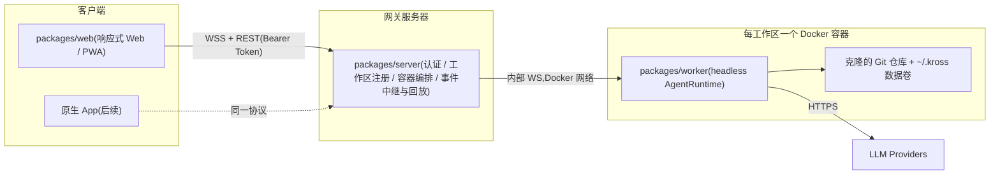

# Kross Cloud Agent 架构方案

> 实施状态（2026-07-23）：P0–P2 已落地。代码分别位于
> `packages/protocol`、`packages/worker`、`packages/server` 和
> `packages/web`；容器入口见 `docker/` 与 `docker-compose.yml`，部署及验收说明见
> [cloud-agent-deployment.md](./cloud-agent-deployment.md)。

## 背景与结论

`packages/core` 已经是与 UI 解耦的 Agent 运行时,云端化不需要重写核心:

- `AgentRuntime.runStreaming()` / `resolveToolApprovalStreaming()` 返回 `AsyncIterable<AgentRunStreamEvent>`(text-delta / thinking-delta / result),TUI 只是消费者之一(见 [packages/tui/src/app/agentStreamConsumer.ts](../packages/tui/src/app/agentStreamConsumer.ts))。
- 会话存储本身就是带 `seq` 的 append-only 事件日志 + SQLite 索引([packages/core/src/session/sessionStore.ts](../packages/core/src/session/sessionStore.ts)),天然支持断线重连后的增量回放——这对移动端弱网场景是关键优势。
- 待审批工具调用已有版本化 checkpoint,跨重启可恢复;远程客户端「稍后再批」开箱即用。
- `bootstrapRuntimeTooling` / `createRuntimeOptionsFromEnv`([packages/core/src/host/createAgentHost.ts](../packages/core/src/host/createAgentHost.ts))支持注入 `krossHome`/`homeDir`,容器内可直接复用。

已确认的方向:**云端执行**(服务端克隆仓库)、**个人自托管**(token 认证)、**Web 优先**(响应式 + PWA,协议层预留原生 App)、**每工作区一个 Docker 容器**。

## 总体架构

选择「worker 进程跑在容器内」而不是「Runtime 在网关进程 + docker exec 桥接」:后者会迫使所有文件/Git/进程工具改造为跨容器调用,侵入性大且隔离有漏洞;前者 core 零改动,容器即安全边界,镜像内置 node + git + ripgrep 即可。

## 新增包(monorepo workspaces)

### 1. packages/protocol — 共享线协议(Web 与原生 App 复用)

- zod schema 定义,带 `protocolVersion`;客户端命令:创建/恢复/列出会话、发送用户输入(带 mode)、`approve/reject`(工具与 plan)、abort、切换模型/思考强度、工作区 CRUD。
- 服务端事件:直接序列化现有 `AgentRunStreamEvent` + `TraceEvent`(工具卡片渲染来源)+ `PendingToolApproval` + todo/context 快照,统一包一层 `{ seq, sessionId, event }` 信封。
- 重连语义:客户端带 `lastSeq` 重连,服务端从会话事件日志回放增量,再接续实时流。

### 2. packages/worker — 容器内 headless Agent 宿主

- 复用 `bootstrapRuntimeTooling` + `AgentRuntime`,按会话维护 Runtime 实例(现有 JSONL/checkpoint 恢复机制直接可用)。
- 参照 `agentStreamConsumer.ts` 的消费逻辑,把 `runStreaming` 事件流转成协议事件写到内部 WS,同时照常落盘会话存储(容器数据卷)。
- 审批:收到 `approve/reject` 后调用 `resolveToolApprovalStreaming`;客户端离线期间挂起状态留在内存 + checkpoint,不阻塞。
- LLM 配置来自容器环境变量或数据卷内 `~/.kross/config.json`,复用现有优先级逻辑。

### 3. packages/server — 网关

- 认证:单用户 Bearer Token(配置文件生成),HTTPS 交给反向代理。
- 工作区管理:登记 Git URL + 凭证(HTTPS token / deploy key)→ 创建命名数据卷 → 起 worker 容器并在卷内克隆;容器生命周期(启动/停止/空闲回收)用 dockerode 管理,需挂载 docker socket(部署文档注明该权限含义)。
- 路由与中继:客户端 WS ↔ 对应容器 worker WS 的转发;REST 提供会话列表、工作区列表、trace/diff 查询。
- 断线回放:按 `lastSeq` 从 worker 侧事件日志取增量。

### 4. packages/web — 响应式 Web 客户端(PWA)

- React + Vite,移动优先的响应式布局,manifest + service worker 支持添加到主屏幕。
- 功能:流式 Markdown 对话(含 thinking 折叠)、工具调用卡片、审批卡片(Approve/Reject)、plan/conductor 计划确认、Todo 面板、diff 查看、会话列表与恢复、工作区管理、模型/思考强度切换——对齐 TUI 现有能力。
- 断线自动重连 + `lastSeq` 增量补齐,弱网可用。

## core 需要的改动(刻意最小化)

- 基本零改动;唯一候选是把 TUI 的流消费/审批状态机中可复用的部分下沉或在 worker 中复刻(优先复刻,不动 core)。
- `StoredSessionMessage.tool` 字段目前「由 TUI 自己解释」,协议层需要给它定义稳定 schema(放在 protocol 包,不改 core)。

实际实施保持了 `core` 零改动。`protocol` 也不直接依赖 `core`，避免浏览器构建把
Node/SQLite 运行时打入 Web 包；线协议中的稳定 schema 独立维护，并通过协议测试
校验兼容性。

## 分阶段落地

- **P0 后端闭环**:protocol + worker + server;单工作区容器内跑通「建会话 → 流式对话 → 工具审批 → 断线重连回放 → /resume」,用脚本或最小页面验证。
- **P1 Web 客户端**:上述完整功能 + 响应式布局 + PWA。
- **P2 增强**:Web Push 审批通知(移动端锁屏可批)、Git 分支/push/PR 流、容器空闲回收与资源限额、原生 App 接入(直接复用 protocol 包)。

## 安全要点

- 容器为唯一执行边界:Bash/后台进程全部在容器内,网关不执行用户代码。
- Git 凭证只进对应工作区容器/卷,不落网关日志;token 认证 + 反向代理 TLS;审批策略沿用 core 现有 default 模式(写/执行/网络需确认)。

## 测试流程(由你执行)

P0 完成后:本机 `docker compose up` 起网关,登记一个测试仓库,用 wscat 或最小页面发任务,验证流式输出、审批暂停/恢复、断网重连回放、容器内文件确实被修改;P1 后在手机浏览器上走同样流程。

## 实施清单

| 阶段 | 任务 |
|------|------|
| P0 | 新建 `packages/protocol`:zod 线协议(命令/事件信封/seq 回放语义/版本号) |
| P0 | 新建 `packages/worker`:容器内 headless Agent 宿主,封装 runStreaming/审批/会话恢复为内部 WS 服务 |
| P0 | 编写 worker Docker 镜像(node + git + ripgrep + kross)与数据卷布局 |
| P0 | 新建 `packages/server`:token 认证、工作区/容器编排(dockerode)、WS 中继与 lastSeq 回放、REST 查询 |
| P0 | 闭环联调:建会话→流式对话→工具审批→断线重连→resume |
| P1 | 新建 `packages/web`:响应式 React 客户端(流式对话/审批卡片/计划确认/Todo/diff/会话与工作区管理) |
| P1 | PWA 支持(manifest/service worker)与移动端体验打磨 |
| P2 | Web Push 审批通知、Git push/PR 流、容器空闲回收与资源限额 |
