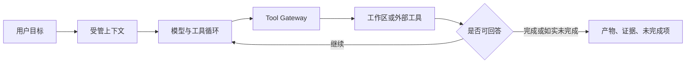

# Agent Harness

Harness 位于模型和真实副作用之间，负责自动工作闭环、工具调度、恢复和结果收口。

## 工作闭环

用户不选择模式。Runtime 根据目标自动组织 Todo 和子任务；“先给方案”由自然语言约束表达。

## 上下文

长期上下文只来自平台记忆和会话固定 Skill。普通工作区文件只有在用户或 Agent 明确读取后才作为资料进入对话。Context Governor 会老化历史工具输出、滚动摘要较早轮次，并对无法治理的单条超大消息做有界截断。

## 工具调度

- 独立 read 调用最多 4 个并发，并按原 tool-call 顺序回填。
- 文件写入、Task 和外部工具保持有序。
- 工作区 read/write 自动允许；network 与未知外部副作用暂停确认。
- 默认工具不包含任意命令、仓库操作或后台进程。

## 子任务

Task 最多派生一层子任务。`explore` 只读；`general` 额外获得 Write/Edit。子任务继承同一工作区、模型和活动 Skill，不能删除、移动、继续派生或访问外部系统。

## 完成与停滞

完成契约不假设任务是软件开发。结果报告统一包含 `artifacts`、`evidence` 和 `incompleteItems`。完成门要求实际生成用户回复；无法完成时必须明确保留未完成项。

Stall Guard 对连续调用和结果生成指纹。重复无进展时先注入恢复提示，仍无进展则有限停止，避免无限循环。

## Checkpoint 与恢复

等待外部工具确认时，open turn 与 run checkpoint 一起保存。恢复时核对 call ID、已有结果、当前工具定义和实时策略。只有确定尚未执行的调用可以继续；已完成的写入或外部副作用绝不猜测性重放。证据损坏时 fail closed 并把悬空轮次标记为 interrupted。

## 可观测性

浏览器展示文本、思考和友好工具状态，不展示原始工具参数。内部 Trace 可记录生命周期、usage 和有限预览，用于运维诊断，不是普通用户功能，也不是计费账本。
