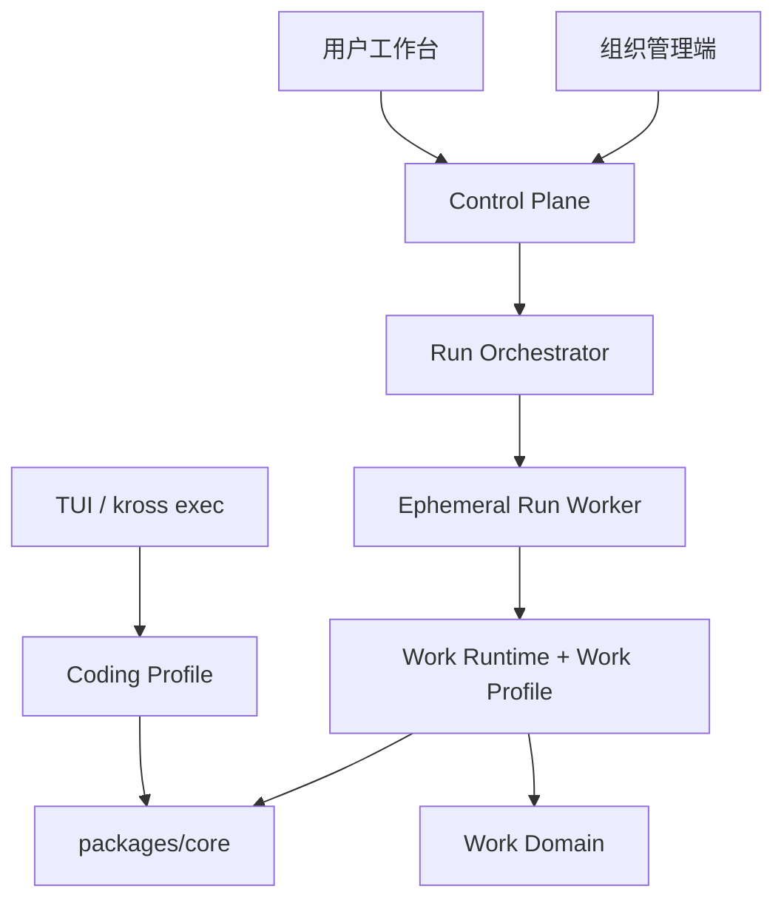
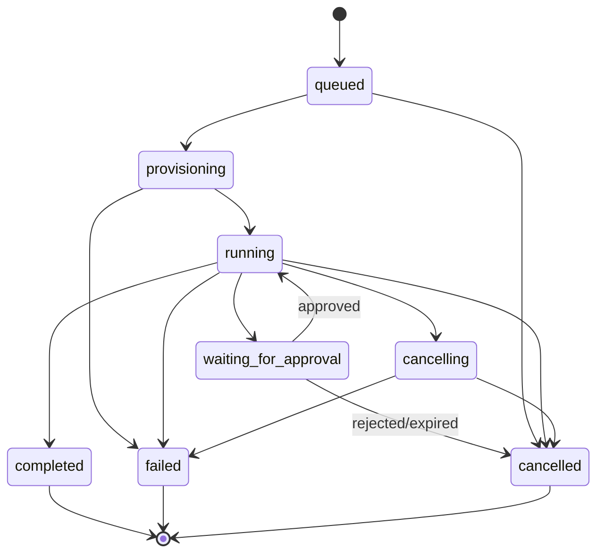
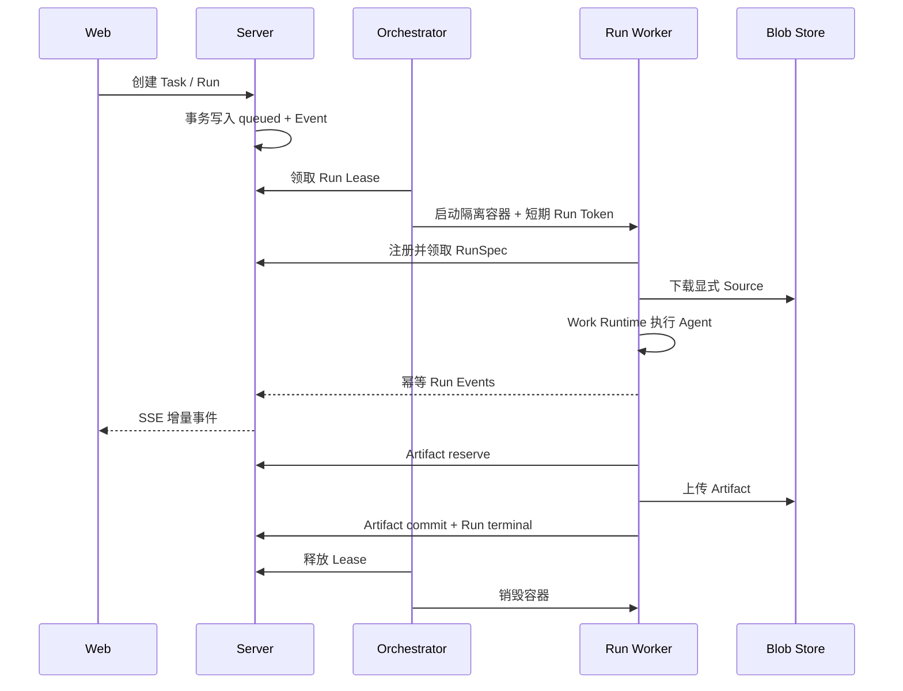

# Kross SaaS Work Agent 完整实施方案

> 状态：实施中；P0–P5 已形成可运行纵向版本，尚未达到生产 SaaS 完成定义
>
> 初稿日期：2026-08-12
>
> 最近更新：2026-08-13（`42a20de`）
>
> 实施分支：`codex/saas-work-agent`
>
> 目标：破坏性重做现有 Cloud Web 产品，将其升级为多租户就绪的通用 Work Agent；
> 本地 TUI、`kross exec` 和 Coding Agent 用户体验保持不变。

## 1. 决策摘要

本次改造采用一仓两产品的结构：

- 本地产品继续是 Coding Agent，由 `packages/tui` 和 `kross exec` 直接使用现有
  Coding Profile；不引入 SaaS 的 Project、Task、Artifact 或租户概念。
- 云端产品升级为 Work Agent，由全新的 Web、控制面和运行执行面组成，支持通用
  项目、长期任务、资料源、审批、交付物、连接器和定时运行。
- `packages/core` 继续承担模型、上下文、工具、审批 Checkpoint、Trace、MCP 和
  子代理等 Agent 内核能力，但通过新增的执行 Profile 扩展点区分 Coding 与 Work
  行为。默认 Profile 永远保持当前 Coding 行为。
- 现有 Cloud Protocol v1、Git Workspace 数据模型、Web UI 和单令牌控制面不保留
  兼容层，直接替换为 v2。
- 现有本地 `~/.kross` 数据、TUI 会话、配置、Trace 和 mutation journal 不迁移、
  不删除，也不改变格式。
- 首个可部署版本以“单集群、多租户就绪”为目标。开发环境可以单用户运行，但所有
  持久化记录从第一天开始携带组织边界，避免后续再做租户拆分。
- 云端前端拆成两个独立产品入口：普通用户工作台 `packages/web` 与组织管理端
  `packages/admin-web`。两端共享控制面和设计语言，但不共享路由、权限入口或产品
  信息架构。

### 1.1 当前实施快照

截至 2026-08-13，分支 `codex/saas-work-agent` 已经可以通过 Docker Compose 启动，
默认入口为：

- 用户端：`http://localhost:8787`
- 组织管理端：`http://localhost:8788`

当前版本已经完成 PostgreSQL migration、Protocol v2、Work Domain、Run
Orchestrator、Worker Runtime、Source/Artifact 基础链路、Approval/Checkpoint、用户
工作台和组织管理端的可运行纵向实现。`npm run check` 共通过 194 个测试文件、1101
项测试；隔离 Compose Smoke 已覆盖 PostgreSQL、Migration、Server、Orchestrator、
Worker 镜像、用户端和管理端。

这不代表生产版本已经完成。当前能力分为三类：

| 分类 | 当前状态 | 说明 |
|---|---|---|
| 已形成真实纵向链路 | 多租户数据、Project/Task/Run、消息、Source、Artifact、Approval、Lease、Worker Token、双 Web 部署 | 已有真实 PostgreSQL/Docker/浏览器验收 |
| 已有基础实现但仍需加固 | Checkpoint 恢复、Connector/Schedule、移动端、Artifact 预览、模型配置 | 有合同或骨架，不等于生产质量 |
| 尚未实现 | 生产 OIDC/Session/CSRF、Credential Broker、真实 OAuth Connector、平台运营后台、计费配额、完整监控告警、备份恢复演练 | 属于 P6–P7 的发布阻塞项 |

按产品完成度评估：技术底座约 60%，普通用户 MVP 约 45%，可运营 SaaS 约 25%。后续
评审应以本节和第 19、22 节为准，不能把“接口存在”计作“产品完成”。

## 2. 产品目标与非目标

### 2.1 产品目标

用户应能够：

1. 登录并进入组织空间。
2. 创建普通项目或绑定 Git 仓库的项目。
3. 上传文件、添加网页或选择连接器资料作为可信度可追踪的 Source。
4. 创建有明确目标和交付要求的 Task。
5. 观察一次 Run 的计划、步骤、工具、子代理和验证进度。
6. 在高风险外部动作、计划执行或工具调用前审阅并批准。
7. 在 Run 结束后查看、预览和下载 Artifact。
8. 对失败或已完成任务继续追问，从已有资料和 Artifact 创建新的 Run。
9. 关闭浏览器后让 Run 继续执行，并在需要审批或运行结束时收到通知。
10. 将稳定任务配置为定时运行，并查看每次运行记录。

### 2.2 第一版非目标

- 不修改 TUI 页面、命令、快捷键和本地 Coding Agent 定位。
- 不把 SaaS Project/Task 数据同步到本地 TUI。
- 不兼容或迁移现有 Cloud Workspace/Session 数据。
- 不在第一版实现计费、发票、公开插件市场或企业 SCIM。
- 不在第一版承诺任意 Office 文件都能在线编辑；先支持生成、预览常见格式和下载。
- 不在控制面进程中执行 Shell、浏览器、OCR、文档解析或 Agent 工具循环。
- 不让 Server 进程直接挂载 Docker Socket。
- 不默认允许 Agent 无审批发送邮件、发布内容、提交表单或执行不可逆外部动作。

## 3. 架构原则

### 3.1 一仓两产品，内核共享，语义隔离



必须通过依赖边界测试保证：

- `core` 不依赖 `work-domain`、`protocol`、`server`、`worker` 或 `web`。
- `tui` 不依赖 `work-domain`、SaaS Protocol、Server 或 Worker。
- `work-domain` 不依赖 Node.js API、数据库、React 或 Core。
- `work-runtime` 可以依赖 `core` 与 `work-domain`，但不依赖 Web 或 Server。
- `protocol` 只包含浏览器安全的 schema、类型和版本化事件。
- Server 不通过源码深路径访问 Core；Worker 不直接访问控制面数据库。

### 3.2 控制面与执行面分离

Node.js Server 只处理 I/O 型工作：鉴权、API、数据库、SSE、调度、审批、通知和
Worker 协调。CPU 密集型或不可信工作全部进入隔离 Worker。

首版不需要更换 Node.js。模型调用、数据库、对象存储、SSE 和连接器主要是异步
I/O；真正的容量瓶颈通常来自模型限流、浏览器内存、Worker 容器和外部服务。必须
避免在 Server 请求路径使用同步文件读取、大型 JSON 转换、文档解析和图片处理。

### 3.3 Run 是执行与隔离单位

现有 Cloud 以 Git Workspace 创建长期 Worker。新架构改为以 Run 为调度单位：

- Project、Task、Source、Artifact 持久存在于控制面。
- 每个 Run 获得独立执行目录、短期访问令牌和资源限额。
- Run 完成后 Worker 可以销毁；Artifact、事件和 Checkpoint 留在持久层。
- 同一 Task 默认只允许一个非终态 Run，后续追问创建新 Run。
- Orchestrator 抽象 Docker 实现，未来可以增加 Kubernetes 实现而不修改领域模型。

### 3.4 所有外部副作用都可识别、可审批、可审计

文件生成与外部动作必须分开：在隔离目录生成报告不等于把报告发送给第三方。
任何邮件发送、表单提交、内容发布、仓库 Push、工单写入或数据删除都必须声明明确
风险，并根据组织策略进入 Approval。

### 3.5 事件只传元数据，大内容进入 Blob Store

Run Event、SSE 和数据库 JSONB 不保存完整附件、Artifact、长工具输出或二进制。
大内容写入 Blob Store，事件只保存摘要、哈希、大小、MIME、来源和对象引用。

### 3.6 用户端与管理端的信任边界

- 用户端和管理端使用不同静态构建产物与 Nginx 入口，默认端口分别为 `8787` 和
  `8788`。
- 两端只通过 Public/Admin REST API 使用控制面，均不直接访问 PostgreSQL、Blob
  根目录、Orchestrator 或 Docker Socket。
- `/api/v2/admin/*` 必须重新解析 OrganizationContext 并执行 owner/admin 权限检查，
  不能因为请求来自管理端域名就自动信任。
- 所有管理写操作必须记录 Audit Event；Credential API 只接受 Handle/Secret
  Provider 引用，禁止通过响应或日志返回长期凭证明文。
- 平台运营后台属于更高信任域，未来应使用独立应用、身份声明和 API namespace，
  不能复用组织管理端的 owner 权限。

## 4. 代码边界与目标包结构

```text
packages/
  core/              # 保留：Agent 内核与默认 Coding Profile
  tui/               # 冻结：本地 Coding Agent UI 与 Headless 入口
  eval/              # 保留并扩展：Coding 与 Work 两套 Eval

  work-domain/       # 新增：纯领域类型、状态机和策略契约
  work-runtime/      # 新增：Work Profile、Source 物化、Artifact 收集、完成策略
  protocol/          # 破坏性升级：Public Event v2 + Internal Worker Protocol v2
  server/            # 重写：API、身份、租户、持久化、队列、通知、Connector Proxy
  orchestrator/      # 新增：Docker 调度、租约、资源限制、容器回收
  worker/            # 重写：无状态 Run Executor，复用 Core 与 Work Runtime
  web/               # 重写：SaaS Work Agent Web/PWA
  admin-web/         # 新增：组织成员、模型、策略、连接器与审计管理端

docker/
  server.Dockerfile
  orchestrator.Dockerfile
  worker.Dockerfile
  web.Dockerfile
  admin-web.Dockerfile
```

暂不单独创建 `storage`、`artifacts` 或 `connectors` workspace。先在 Server 内以
接口和目录边界实现；只有出现第二个独立消费者或包体明显失控时再拆包，避免为目录
整洁提前制造跨包协议。

### 4.1 修改权限表

| 区域 | 改造策略 |
|---|---|
| `packages/tui/**` | 不修改；测试或确有阻塞时需维护者单独批准 |
| `packages/core/**` | 只允许新增通用扩展点和内部解耦；默认 Coding 行为必须完全回归 |
| `packages/eval/**` | 保留现有 Coding Eval，新增 Work Eval，不替换旧案例 |
| `packages/protocol/**` | 直接升级 v2，不兼容旧 Web/Worker |
| `packages/server/**` | 破坏性重写 |
| `packages/worker/**` | 破坏性重写为 Run Executor |
| `packages/web/**` | 破坏性重写 |
| `packages/admin-web/**` | 独立新增；仅承载组织管理能力，不混入普通用户任务工作台 |
| `docker/**` | 按新控制面与执行面重写 |

## 5. 核心术语与领域模型

### 5.1 层级

```text
Organization
├── Membership
├── Project
│   ├── Source
│   ├── Task
│   │   ├── TaskMessage
│   │   ├── Run
│   │   │   ├── RunEvent
│   │   │   ├── Approval
│   │   │   └── Artifact
│   │   └── Schedule（可选）
│   └── ConnectorInstallation
├── ModelProfile
└── AuditEvent
```

新产品中 `Workspace` 不再是业务实体。该词只用于 Worker 内部临时文件系统，例如
`ExecutionWorkspace`，避免与组织或项目混淆。

### 5.2 实体定义

#### Organization

租户与权限边界。关键字段：

- `id`、`slug`、`name`
- `status: active | suspended | deleted`
- 默认时区、数据保留策略、审批策略
- `createdAt`、`updatedAt`

#### Membership

- `organizationId`、`userId`
- `role: owner | admin | member | viewer`
- `status: invited | active | disabled`

第一版 Project 默认继承组织权限；暂不实现独立 Project ACL，但所有 Repository
接口都必须接收组织上下文，不能只按资源 ID 查询。

#### Project

- `kind: general | repository`
- `name`、`description`
- Repository 项目额外包含 Git URL、默认分支和凭证引用
- 默认模型档案、默认权限策略、默认任务类型
- 不直接保存凭证明文

#### Source

表示 Agent 可以引用的输入资料：

- `kind: upload | url | repository | connector | generated`
- `scope: project | task`
- `status: uploading | processing | ready | failed | deleted`
- `displayName`、`mimeType`、`sizeBytes`、`sha256`
- `blobKey` 或不可变外部来源定位符
- `origin`、`createdBy`、`createdAt`
- 可选解析文本、引用索引和解析诊断的对象引用

Source 内容不可原地覆盖。用户更新文件时创建新版本，并保留来源链。

#### Task

用户委派的一项长期工作，也是后续追问的对话容器：

- `type: general | research | document | data | coding | automation`
- `title`、`objective`、`constraints`、`acceptanceCriteria`
- `status: open | completed | cancelled | archived`
- `latestRunId`、`createdBy`、时间字段

Task 完成后仍可通过新消息重新打开并创建新的 Run。Task 状态不代替 Run 状态。

#### TaskMessage

- `role: user | agent | system`
- `content` 使用结构化块，至少支持文本、Source 引用和 Artifact 引用
- 可选 `runId`
- 用户消息追加后不可修改；UI 的编辑行为实际创建新消息并启动新 Run

工具调用和思考过程不进入 TaskMessage，而进入 RunEvent。

#### Run

- `taskId`、`attempt`
- `status`
- `requestedModelProfileId`、实际 Provider/模型快照
- `executionProfile`、权限策略快照、资源限额
- `queuedAt`、`startedAt`、`finishedAt`
- `failureCode`、`failureSummary`
- token、费用、持续时间和工具调用聚合
- `checkpointKey`、`executionWorkspaceId`

Run 的策略与模型必须保存快照，避免组织设置变化后无法解释历史结果。

#### RunEvent

每个 Run 的 append-only 事实流：

- `(runId, seq)` 唯一且严格递增
- `type`、`timestamp`、`payload`
- Worker 重试上报同一 `seq` 必须幂等
- 控制面额外生成全局 `eventId` 供 SSE cursor 使用
- payload 受大小限制并经过脱敏

#### Approval

- `kind: plan | tool | external_action | elevated_access`
- `status: pending | approved | rejected | expired | cancelled`
- 风险级别、面向用户的动作预览、结构化目标
- `runId`、`toolCallId` 或外部动作幂等键
- 决策人、原因、决策时间和过期时间

批准只能消费一次。重复提交决策必须返回原结果，不能重复触发工具。

#### Artifact

Run 产生的可审阅交付物：

- `kind: document | spreadsheet | presentation | image | data | code | archive | other`
- `status: pending | ready | failed | deleted`
- `displayName`、`mimeType`、`sizeBytes`、`sha256`、`blobKey`
- `runId`、`taskId`、`createdAt`
- `parentArtifactId` 表示修订链
- 可选预览、缩略图、来源引用清单和生成诊断对象引用

Artifact 不覆盖历史版本。后续 Run 修改交付物时创建新 Artifact，并用
`parentArtifactId` 关联。

#### ConnectorInstallation

- 连接器定义 ID、组织/项目作用域
- 状态、授权用户、scope 清单
- 加密凭证引用、最近检查时间和错误类别
- 工具与资源能力快照

#### ModelProfile 与 CredentialHandle

- ModelProfile 保存组织可选择的供应商、模型 ID、非敏感配置、状态和可选
  CredentialHandle 引用。
- CredentialHandle 只保存 Secret Provider 中的引用和非敏感元数据，不保存可由管理
  API 读回的模型 Key、OAuth Token 或私钥。
- Run 创建时保存模型与策略快照；Worker 只获得短期、Run-scoped 的凭证能力。
- 当前 migration 和 Admin API 已支持两类元数据，但真实 Secret Provider、轮换和短期
  Credential Broker 尚未实现。

#### Schedule

- 任务模板、项目、Source/Connector 选择
- cron/间隔表达式、时区、`nextRunAt`
- `status: active | paused | deleted`
- 并发策略：`skip | queue | replace`
- 外部动作策略，默认 `draft_only`

### 5.3 Run 状态机



约束：

- 终态不可变。
- 同一 Task 第一版最多一个 `queued/provisioning/running/waiting_for_approval/cancelling`
  Run。
- 失败重试创建新 Run，不重置旧 Run。
- 所有状态变化与相应 Event 在同一数据库事务中提交。

## 6. Core 通用化策略

当前 Core 的系统提示、代码 mutation 验证、Conductor Diff Review 和完成门均面向
软件工程。不能简单把 Core 原样接入通用 Work Task。

新增 `AgentExecutionProfile`，建议至少包含：

```ts
interface AgentExecutionProfile {
  id: 'coding' | 'work';
  buildSystemPrompt(context: ExecutionProfileContext): string;
  createCompletionPolicy(context: ExecutionProfileContext): CompletionPolicy;
  createReviewPolicy?(context: ExecutionProfileContext): ReviewPolicy;
  describeProgress(event: LifecycleEvent): ProgressDescriptor | undefined;
  getContextSources(context: ExecutionProfileContext): ContextSource[];
  getToolPolicy(context: ExecutionProfileContext): ToolPolicyOverlay;
}
```

实施约束：

- `createAgentHost()` 默认构造现有 `coding` Profile，现有调用方无需传参。
- TUI、Headless 和现有 Eval 不显式感知 Work Profile。
- `work-runtime` 注入 Work Profile，不修改全局 Prompt Catalog 的 Coding 文案。
- Completion Gate 从“文件修改后必须跑代码验证”抽象为 Profile Policy。
- Coding Policy 继续使用现有 mutation-aware verification，行为和测试完全不变。
- Work Policy 根据 Task 类型检查 Source、Artifact、引用和外部动作，不把 DOCX 或
  CSV 生成误判为未运行代码测试。
- Work MVP 的 Conductor 只在 Review Policy 完成后开放；在此之前可以先支持
  `auto` 和 `plan`，不能复用面向 Git Diff 的 Conductor Reviewer 冒充通用复核。

### 6.1 Work Completion Policy

| Task 类型 | 最小完成证据 |
|---|---|
| `general` | 目标响应或至少一个声明的 Artifact；无未决审批 |
| `research` | 来源清单、关键结论引用覆盖、未确认事实清单 |
| `document` | 目标 Artifact 存在、可读取、MIME/大小有效、结构检查通过 |
| `data` | 输入清单、输出 Artifact、Schema/公式或抽样验证结果 |
| `coding` | 继续使用 Coding Verification，并生成 Diff/代码 Artifact |
| `automation` | 每个外部动作都有幂等结果；未授权动作保持草稿或待审批 |

所有 Policy 都允许以 `failed` 或 `blocked` 诚实结束，但不能把缺少交付物、失败验证
或未决关键审批报告为 `completed`。

## 7. Source 与 Artifact 执行协议

### 7.1 Source 上传与物化

1. Web 请求创建上传，Server 创建 `Source(uploading)`。
2. 小文件可以流式经过 Server；生产大文件使用 Blob Store 预签名上传。
3. 客户端提交上传完成，Server 校验大小、哈希和 MIME，将 Source 置为
   `processing`。
4. Ingestion Job 在隔离 Worker 中解析文本、生成预览和诊断；原文件始终保留。
5. 解析成功后 Source 进入 `ready`；失败保留原文件和稳定错误类别。
6. Run 启动时，只把显式选择且状态为 `ready` 的 Source 物化到执行目录：

```text
/work/input/manifest.json
/work/input/sources/<source-id>/<safe-file-name>
/work/output/
/work/repository/       # 仅 repository Project
```

`manifest.json` 保存 Source ID、原始名称、MIME、哈希和来源，不把外部内容伪装成
系统指令。

### 7.2 Artifact 上传

Worker 不能把二进制放进 WebSocket 事件：

1. Work Runtime 在 `/work/output` 发现模型声明的交付物。
2. Worker 计算大小和 SHA-256，发送 `artifact.reserve`。
3. Server 创建 `Artifact(pending)` 并返回短期上传凭证。
4. Worker 流式上传内容。
5. Worker 发送 `artifact.commit`；Server 校验后置为 `ready`。
6. Server 发布 `artifact.ready`，Web 刷新预览。

首版内置预览：Markdown、纯文本、JSON、CSV、常见图片和 PDF。DOCX、XLSX、PPTX
先提供下载与基础元数据；渲染预览作为后续增量能力。

## 8. Public API 与 Protocol v2

### 8.1 协议拆分

现有 v1 把浏览器命令、Worker 命令和事件放在一个 discriminated union。v2 拆成：

- Public REST API：资源 CRUD、动作命令、分页与幂等键。
- Public Event API：SSE 增量事件，仅用于通知和运行流。
- Internal Worker Protocol：RunSpec、租约、执行事件、审批恢复和 Artifact 上传。

`@kross/protocol` 继续用 Zod 作为事实源并生成 JSON Schema。Public API 文档可以从
相同 schema 生成 OpenAPI，但不能维护第二套手写类型。

### 8.2 Public REST 路由

建议最小路由：

```text
GET    /api/v2/me
GET    /api/v2/organizations

GET    /api/v2/projects
POST   /api/v2/projects
GET    /api/v2/projects/:projectId
PATCH  /api/v2/projects/:projectId
DELETE /api/v2/projects/:projectId

GET    /api/v2/projects/:projectId/sources
POST   /api/v2/projects/:projectId/sources/uploads
POST   /api/v2/projects/:projectId/sources/inline
POST   /api/v2/projects/:projectId/sources/external
POST   /api/v2/sources/:sourceId/complete
DELETE /api/v2/sources/:sourceId

GET    /api/v2/projects/:projectId/tasks
POST   /api/v2/projects/:projectId/tasks
GET    /api/v2/tasks/:taskId
GET    /api/v2/tasks/:taskId/messages
POST   /api/v2/tasks/:taskId/messages
POST   /api/v2/tasks/:taskId/runs

GET    /api/v2/runs/:runId
POST   /api/v2/runs/:runId/cancel
POST   /api/v2/runs/:runId/retry
GET    /api/v2/runs/:runId/events

GET    /api/v2/approvals
POST   /api/v2/approvals/:approvalId/decision

GET    /api/v2/tasks/:taskId/artifacts
GET    /api/v2/artifacts/:artifactId
GET    /api/v2/artifacts/:artifactId/content

GET    /api/v2/connectors
POST   /api/v2/connectors/:connectorId/install
DELETE /api/v2/connector-installations/:installationId

GET    /api/v2/schedules
POST   /api/v2/schedules
PATCH  /api/v2/schedules/:scheduleId
DELETE /api/v2/schedules/:scheduleId

GET    /api/v2/events

POST   /api/v2/admin/bootstrap
GET    /api/v2/admin/dashboard
GET    /api/v2/admin/members
POST   /api/v2/admin/members
PATCH  /api/v2/admin/members/:membershipId
DELETE /api/v2/admin/members/:membershipId
GET    /api/v2/admin/models
POST   /api/v2/admin/models
PATCH  /api/v2/admin/models/:modelProfileId
DELETE /api/v2/admin/models/:modelProfileId
GET    /api/v2/admin/credentials
POST   /api/v2/admin/credentials
PATCH  /api/v2/admin/credentials/:credentialHandleId
DELETE /api/v2/admin/credentials/:credentialHandleId
GET    /api/v2/admin/connectors
GET    /api/v2/admin/approval-policy
PATCH  /api/v2/admin/approval-policy
GET    /api/v2/admin/audit-logs
```

创建 Task、Run、Approval Decision 和外部动作必须支持 `Idempotency-Key`。重复请求
返回第一次结果。

当前实现已覆盖 Project/Task/Message/Run、Source、Artifact、Approval、Connector、
Schedule 和 Admin 主路径；Project/Task/Source 的完整更新/删除、Run retry、通用分页
以及 OpenAPI 仍待补齐。上述列表是目标 REST 合同，不应因为路由列在文档中就推断其
已经全部实现。

### 8.3 SSE 契约

- `GET /api/v2/events` 使用 HTTP-only Session 鉴权。
- 支持 `Last-Event-ID` 和查询参数筛选 project/task/run。
- Event ID 是控制面生成的不透明全局 cursor，不把数据库序号当业务 API。
- 客户端必须能在 SSE 断线时继续通过 REST 读取权威快照。
- SSE 事件只是失效通知和增量体验，不是资源唯一事实源。
- 单连接设置心跳、最大缓冲和慢消费者断开策略。

关键事件：

```text
task.created
task.updated
run.queued
run.status_changed
run.progress
run.message_delta
run.tool_started
run.tool_completed
run.approval_requested
approval.decided
artifact.ready
run.completed
notification.created
```

文本 delta 可以短暂存在 Event 表并按保留策略压缩；终态 Agent 文本必须落为
TaskMessage，不能依赖重放所有 delta 才能恢复。

## 9. 控制面持久化与任务队列

### 9.1 技术选择

推荐首版：

- PostgreSQL：领域数据、事件、审计、幂等键和队列租约。
- SQL migrations + `pg`：显式 SQL 和 Repository 层，不让 ORM 类型进入 Domain。
- `BlobStore` 接口：开发使用本地文件系统，生产使用 S3-compatible Object Store。
- 不引入 Redis；Run Queue 先使用 PostgreSQL lease queue。

队列表至少包含 `available_at`、`lease_owner`、`lease_expires_at`、`attempts` 和状态索引。
领取使用事务与 `FOR UPDATE SKIP LOCKED`；交付语义是 at-least-once，因此所有 Job
Handler、Worker 事件和外部动作必须幂等。

### 9.2 主要表

```text
users
organizations
organization_memberships
projects
project_repository_bindings
sources
task_sources
tasks
task_messages
runs
run_events
approvals
artifacts
connector_definitions
connector_installations
model_profiles
schedules
schedule_occurrences
notifications
audit_events
idempotency_keys
run_leases
```

除全局定义表外，每张业务表都直接携带 `organization_id`，查询必须同时约束租户和
资源 ID。数据库外键、唯一索引和 Repository 测试共同验证租户隔离。

## 10. Orchestrator 与 Worker 生命周期

### 10.1 为什么拆出 Orchestrator

当前 Gateway 挂载 Docker Socket，等价于宿主机高权限控制面。新架构将 Docker
操作移动到独立 `packages/orchestrator` 服务：

- Server 不挂载 Docker Socket。
- Orchestrator 不暴露公网，只持有受限内部服务凭证。
- Orchestrator 从 Server 领取 Run Lease，创建、观察和清理 Worker。
- Docker 实现遵循统一 `ExecutionBackend`，未来可以增加 Kubernetes Adapter。

### 10.2 一次 Run 的完整流程



### 10.3 恢复

- Worker 定期把 Core Checkpoint 写入 Run 的持久卷，并上报 checkpoint 元数据。
- Docker 首版使用每 Run named volume；重启 Worker 时重新挂载。
- Server 的 RunEvent 是 UI 事实源，Worker 本地 Journal 只负责断线重传。
- Worker 上报事件携带 `(runId, workerGeneration, seq)`；Server 去重。
- Lease 过期后，Orchestrator 先确认旧容器已终止，再启动新 generation。
- 已完成的 write/execute 工具不能因恢复而猜测性重放，继续使用 Core 当前的
  fail-closed Checkpoint 规则。

### 10.4 资源限制

每 Run 设置：

- CPU、内存、PID、磁盘和最长运行时间。
- 最大 Source 总大小、最大 Artifact 总大小和最大事件 payload。
- 网络策略与允许的 Connector scope。
- 非 root 用户、丢弃 capabilities、`no-new-privileges`。

## 11. 身份、租户与凭证

### 11.1 身份接口

Server 定义 `IdentityProvider`，生产通过 OIDC/OAuth 身份提供方登录，开发环境提供
显式 Dev Identity。不要自己实现密码哈希、找回密码和 MFA。

浏览器使用 Secure、HttpOnly、SameSite Cookie。所有状态修改检查 Origin/CSRF；
Bearer Token 只用于内部服务、CLI API Token 或自动化，不放入浏览器 LocalStorage。

### 11.2 RBAC

| 动作 | owner | admin | member | viewer |
|---|---:|---:|---:|---:|
| 管理组织/成员 | 是 | 部分 | 否 | 否 |
| 管理模型/连接器凭证 | 是 | 是 | 否 | 否 |
| 创建项目/任务 | 是 | 是 | 是 | 否 |
| 批准普通动作 | 是 | 是 | 是 | 否 |
| 批准组织级高风险动作 | 是 | 按策略 | 否 | 否 |
| 查看项目与 Artifact | 是 | 是 | 是 | 是 |

Approval 决策还必须验证用户能访问对应 Task/Run，不能只检查 Approval ID。

### 11.3 Secrets

- 目标状态下数据库只保存加密密文或 Secrets Provider 引用。
- 当前实现只允许管理 Credential Handle 引用和安全元数据，并拒绝疑似 secret、token、
  password、API key 字段；它尚未提供生产 Secret Provider。
- 后续开发环境可使用版本化 AES-GCM envelope encryption，主密钥来自环境或文件
  挂载；生产实现接 KMS/Secret Manager，并通过短期 Credential Broker 向 Run 授权。
- OAuth refresh token、模型 key、Git key 不进入 RunEvent、Trace、错误正文或日志。
- Worker 不接收长期 Connector refresh token；通过 Run-scoped Connector Proxy 调用。

## 12. Connector 与 MCP 策略

现有 MCP Client 可以复用协议能力，但 SaaS 不能直接把用户 OAuth 凭证写进 Worker
环境。目标结构：

```text
Agent Tool Call
    -> Worker MCP/Tool Adapter
    -> Server Connector Proxy（验证 Run、用户、scope、风险）
    -> Remote MCP / SaaS API
```

阶段划分：

1. MVP：管理员配置受信任的 Streamable HTTP MCP；只读工具优先。
2. 第二阶段：Connector Definition、安装状态和 scope UI。
3. 第三阶段：OAuth 授权、刷新与撤销，长期凭证只在 Server。
4. 第四阶段：连接器目录、健康检查和组织策略。

远程内容、网页、邮件和连接器结果始终按不可信数据处理。内容中的指令不能提升为
系统规则。任何写操作默认进入 Approval；Connector Definition 不能自行降低风险。

## 13. Schedule 与通知

Schedule Tick 由 Server 的数据库调度器领取，按用户时区计算 `nextRunAt`。一次触发
创建不可变 `schedule_occurrence` 和新的 Task/Run，不复用上一次 Run。

必须实现：

- `skip/queue/replace` 并发策略。
- 重复 Tick 幂等键。
- 暂停、恢复和错过窗口处理。
- 默认 `draft_only`：定时任务可生成草稿和 Artifact，但外部发送仍等待人工批准。
- 浏览器通知、站内通知；邮件通知放在后续 Connector 能力中。

## 14. Web 产品信息架构

云端包含普通用户工作台和组织管理端两个独立前端。它们可以共享基础组件和视觉
token，但必须分别构建、部署和鉴权。普通组织 `owner/admin` 只能进入自己组织的
管理端；未来的平台运营后台使用独立 `platform_admin` 身份，不得把平台权限编码成
某个普通组织角色。

### 14.1 用户端一级导航

```text
Home
Projects
Tasks
Schedules
Connectors
Settings
```

当前用户端已经落地 Home、Project/Task 导航、History API URL 恢复、组织切换、
Composer、Source 上传/Inline Source、Artifact 下载入口、Approval 和 Run 摘要。尚未
完整落地的设计包括独立 Schedules/Connectors/Settings 页面、Artifact 丰富预览、
Run 完整时间线和离线 PWA。

### 14.2 组织管理端

管理端独立位于 `packages/admin-web`，默认端口 `8788`，当前一级导航为：

```text
Dashboard
Members & Roles
Model Profiles
Connectors
Approval Policy
Audit Logs
```

管理端职责：

- 首次开发部署创建首个 Organization 与 owner；生产部署改由受保护 Provisioning
  流程完成。
- 管理成员邀请、角色、状态和最后一个 owner 保护。
- 管理 Model Profile 与 Credential Handle 元数据；任何 API 都不得回传凭证明文。
- 查看 Connector 安装状态并配置组织级审批与保留策略。
- 查看所有管理写操作产生的 Audit Event。

当前缺口：Credential Handle 的专用 UI、生产密钥写入/轮换流程、组织资料编辑、配额
与用量页面、Schedule 集中管理和平台级运营后台。

### 14.3 用户端关键页面

#### Home

- 最近运行、等待审批、失败任务、最新 Artifact。
- 快速创建任务和常用模板。

#### Project

- 项目概览、Task 列表、Source 列表、Repository/Connector 状态。
- 普通 Project 不要求 Git URL。

#### Task

桌面端使用三段结构，但不沿用现有 Coding 三栏：

- 左侧：项目和 Task 导航。
- 中间：用户消息、Agent 最终消息、运行进度和 Composer。
- 右侧：Artifact、Source、Approval 和 Run 信息，可收起。

移动端通过顶部/底部标签切换，不同时展示三栏。

Composer 支持：

- 文本目标。
- 拖拽上传 Source。
- 选择已有 Source 和 Connector。
- 选择模型、任务类型和权限策略。
- 明确“执行”与“只制定计划”。

#### Run Detail

- 阶段时间线、工具摘要、子代理、token/费用、错误和重试。
- 默认展示可理解的进度；原始 Trace 放入高级检查面板。
- 审批卡必须显示动作、目标、数据范围、风险和一次性效果。

#### Artifact

- 在线预览、下载、来源、版本链和“继续修改”。
- “继续修改”向原 Task 追加消息并创建新 Run，不覆盖原 Artifact。

### 14.4 前端状态策略

- REST 快照是权威状态，SSE 用于增量更新。
- URL 包含 organization/project/task/run 标识，支持刷新恢复。
- 所有创建动作使用幂等键，网络重试不产生重复 Run。
- 乐观更新只用于标题等低风险字段；Approval、Run 状态和 Artifact 不乐观伪造。
- 离线 PWA 可以查看已缓存元数据和排队草稿，但不能宣称命令已提交。

## 15. 安全要求

### 15.1 租户隔离

- 每个 Repository 方法第一个参数是 `OrganizationContext`。
- 每张业务表携带 `organization_id`。
- 对象存储 key 包含不可预测资源 ID，不依赖路径前缀作为唯一授权。
- Artifact 下载每次重新鉴权或使用短期预签名 URL。
- 添加跨租户负面集成测试和对象存储访问测试。

### 15.2 Prompt Injection 与工具安全

- Source、网页、Connector、仓库文件和工具返回都是不可信数据。
- 系统上下文分别标记用户指令、组织策略和外部资料。
- 外部内容不能改变 Tool Risk、审批策略或租户边界。
- Connector Proxy 按服务端 allowlist 验证 tool name、schema 和 scope。
- 高风险动作使用结构化预览，审批后再次解析并验证原始参数哈希。

### 15.3 文件安全

- 上传限制大小、文件数、MIME 和扩展名；文件名规范化，禁止路径穿越。
- 解压在隔离 Ingestion Worker，限制展开大小、文件数、嵌套深度和符号链接。
- 预览使用独立域名或强 CSP，不能在主应用源执行上传的 HTML/SVG/脚本。
- 下载响应使用正确 `Content-Disposition` 和 `X-Content-Type-Options`。
- 后续可接恶意文件扫描，但第一版至少隔离解析并禁止服务端直接执行。

### 15.4 审计

必须记录：登录、成员/角色变化、Project 删除、凭证变化、Connector 安装、Run 创建与
取消、Approval 决策、Artifact 删除、Schedule 变化和管理员操作。审计 payload
禁止包含密钥和完整 Source 内容。

## 16. 可观测性、限额与容量

### 16.1 指标

- HTTP 延迟、错误率、活跃 SSE、慢消费者断开。
- Queue 深度、排队时间、Lease 过期、Run 各状态耗时。
- Worker 启动时间、CPU/内存峰值、退出原因和磁盘使用。
- Provider token、费用覆盖率、限流和稳定错误类别。
- Source 解析、Artifact 上传、Connector 调用和 Approval 等待时间。

### 16.2 关联 ID

所有日志和事件使用：

```text
requestId
organizationId
projectId
taskId
runId
workerGeneration
toolCallId / approvalId / artifactId
```

日志默认不记录 prompt、正文、密钥和上传内容。

### 16.3 首版配额

- 组织并发 Run 数。
- 单 Run 时长、token/费用软硬上限。
- Source/Artifact 大小和总存储。
- 每分钟 API、Run 创建和 Connector 调用次数。
- Schedule 数量与最短周期。

达到硬限制时必须在执行前拒绝或安全取消，不能只记录日志。

## 17. 测试与 Eval

### 17.1 必须保留的回归门

- `packages/tui` 全部现有测试。
- Core Coding Profile 全部现有 Runtime、Harness、工具、Checkpoint 和 Eval。
- CLI package smoke，包括 `kross` 与 `kross exec`。
- Core API surface guard。

### 17.2 新增测试层

| 层级 | 覆盖 |
|---|---|
| Domain 单测 | 状态机、角色权限、策略和不变量 |
| Repository 集成 | PostgreSQL schema、事务、租户隔离、幂等和 Lease |
| Protocol | Zod、JSON Schema、未知事件、大小限制和兼容断言 |
| Work Runtime | Source 物化、Profile、完成策略、Artifact 收集、恢复 |
| Server API | 鉴权、CSRF、分页、SSE cursor、错误映射和限额 |
| Orchestrator | 租约、重复领取、超时、容器清理和资源参数 |
| Worker | RunSpec、事件去重、审批恢复、上传和崩溃恢复 |
| Web | 关键组件、断线恢复、审批、上传和 Artifact 状态 |
| E2E | Project → Task → Run → Approval → Artifact 完整纵向链路 |

### 17.3 Work Eval Fixture

新增无网络 Fixture：

1. 多 Source 研究摘要，检查引用覆盖。
2. Markdown/PDF 文档 Artifact，检查生成与预览元数据。
3. CSV 输入到比较表格，检查 Schema 与数据行数。
4. 外部发送动作停在 Approval，拒绝后不执行。
5. Worker 宕机后从待审批 Checkpoint 恢复，不重放已完成写操作。
6. 相同幂等键重复创建 Run，只产生一个执行。
7. 跨租户读取 Source/Artifact 全部拒绝。

真实模型 Eval 继续要求显式 Provider、模型和预算，不进入普通 CI。

## 18. 破坏性迁移与删除清单

### 18.1 保留

- 本地 `~/.kross` 全部数据。
- `packages/tui` 和 `kross exec` 行为。
- Core Coding Profile、工具、MCP、Trace、Checkpoint、子代理和模型 Adapter。
- 现有 Coding Eval 与 Terminal-Bench 接入。

### 18.2 删除或替换

- Protocol v1 的 `workspace.*`、`session.*` Cloud 命令和事件。
- 现有 `CloudWorkspace`、`SessionSnapshot` Web 领域模型。
- Git URL 必填的 Workspace 创建流程。
- 单一 `KROSS_ACCESS_TOKEN` 浏览器登录方式。
- Server 内 Docker Socket 编排。
- 每 Workspace 长期 Worker 和 Gateway 内 WorkspaceRegistry。
- 现有 Web 三栏 Coding UI、Diff/PR 主入口和旧 Slash Command 映射。

Repository Project 仍可以提供 Diff、Push 和 PR 工具，但它们作为 Work Task 中的
代码能力与外部动作存在，不再决定整个 Cloud 产品的数据模型。

### 18.3 Cloud 数据处理

不编写 v1 到 v2 数据迁移器。新 Compose 使用新的 PostgreSQL、Blob 和 Run Volume
名称；旧卷不会自动删除。运维文档提供显式查看和删除旧卷命令，执行删除前要求维护者
确认精确卷名。

## 19. 分阶段实施路线

每个阶段必须独立可验证、可提交，不把未完成的跨阶段占位逻辑伪装成完成。

### 19.1 当前阶段状态

| 阶段 | 状态 | 已落地 | 主要剩余项 |
|---|---|---|---|
| P0 合同与边界 | 基本完成 | Work Domain、Protocol v2、Execution Profile、TUI 边界 | 后续变更继续守住 Coding 回归 |
| P1 PostgreSQL 基础 | 基本完成 | Migration、RBAC、租户 Repository、Lease、幂等、Audit 基础 | 更完整的管理资源编辑与审计导出 |
| P2 Run 纵向链路 | 部分完成 | Orchestrator、短期 Token、RunSpec、Worker、事件、SSE | 真实模型长任务和崩溃矩阵验证 |
| P3 Source/Artifact | 部分完成 | 本地 Blob、签名上传、物化、reserve/commit、下载入口 | S3 Adapter、丰富预览、修订与继续修改 |
| P4 Approval/恢复 | 部分完成 | Approval 决策、消费约束、Checkpoint 上传/恢复 | 实时通知及副作用前后崩溃全矩阵 |
| P5 用户 Web | 部分完成 | Home、路由、Task、Composer、Source、Artifact、Approval、Run 摘要 | 完整 Run Detail、移动端、PWA、端到端弱网测试 |
| P6 管理/Connector/身份 | 早期实现 | 独立管理端、成员、模型元数据、策略、审计、Schedule/Connector 数据骨架 | OIDC、CSRF、Credential Broker、真实 Connector、通知 |
| P7 生产加固 | 未完成 | Compose、健康检查、隔离 Smoke、部署文档基础 | 配额、限流、指标告警、备份恢复、压测、安全发布门 |

以下 P0–P7 内容继续作为目标与验收合同；表中“部分完成”不得改写成“验收通过”。

### P0：合同与保护边界

目标：为破坏性改造建立不会伤害 TUI 的护栏。

工作：

- 新增 `work-domain`、`work-runtime` 空 workspace 和依赖边界测试。
- 定义 `AgentExecutionProfile` 与 Coding 默认回归测试。
- 冻结当前 TUI、Core、CLI 测试基线。
- 将 Protocol 版本提升为 2，先建立新目录和 schema 生成框架。

验收：

- TUI 源码无改动。
- 现有 Coding 测试、Eval fixture、typecheck、package smoke 全部通过。
- `core -> work-*` 非法依赖被自动测试阻止。

### P1：Work Domain 与 PostgreSQL 基础

目标：建立租户、Project、Task、Run、Event、Approval、Source、Artifact 数据模型。

工作：

- 领域类型、状态机和 Policy。
- SQL migration、Repository 和事务接口。
- Dev Identity、OrganizationContext 和 RBAC。
- PostgreSQL Lease Queue、幂等键和 Audit Event。

验收：

- 所有状态迁移和越权路径有测试。
- 跨组织资源 ID 不可读取、更新或删除。
- 并发领取同一 Run 只产生一个有效 Lease。

### P2：Run Orchestrator 与 Worker 纵向切片

目标：无 Web 也能通过 API 创建普通 Task，并在隔离 Worker 完成一次文本 Run。

工作：

- 独立 Orchestrator 服务和 Docker Backend。
- Run-scoped token、RunSpec、Worker generation、事件上报与租约。
- Work Profile 最小 `general` Completion Policy。
- Server 保存 TaskMessage 和 RunEvent。
- SSE 断线恢复。

验收：

- 创建 Run → Worker 启动 → 流式事件 → 最终消息 → 容器销毁。
- Worker 崩溃、重复事件和 Lease 过期有确定结果。
- Server 容器不挂载 Docker Socket。

### P3：Source 与 Artifact

目标：打通“上传资料 → 完成任务 → 下载交付物”。

工作：

- BlobStore 本地/S3 Adapter。
- 上传、完成、哈希校验和 Source 物化。
- `/work/output` Artifact reserve/upload/commit。
- Markdown、文本、JSON、CSV、图片、PDF 预览。
- `document/research/data` Completion Policy。

验收：

- 大内容不进入 RunEvent。
- 路径穿越、错误哈希、超额上传和跨租户下载被拒绝。
- Artifact 修订不会覆盖历史 blob。

### P4：Approval、Checkpoint 与恢复

目标：高风险动作可在浏览器审批，Worker 重启不重复副作用。

工作：

- Plan/Tool/External Action Approval。
- Web Push/站内通知。
- Run Volume Checkpoint 和 generation 恢复。
- 一次性 Approval 消费和参数哈希复验。

验收：

- 批准、拒绝、过期、重复决策均有 E2E。
- Worker 在审批前后崩溃均不重复已完成写操作。

### P5：Web/PWA 完整替换

目标：新 Web 覆盖 Home、Project、Task、Run、Approval、Source 和 Artifact 主流程。

工作：

- 新路由、布局、组件和 REST/SSE Client。
- 上传、Composer、进度、审批、Artifact 预览和移动端。
- 断线、刷新、空状态、错误和可访问性。
- 删除旧 Web Coding UI 和 v1 Client。

验收：

- Playwright 覆盖首个 Project 到 Artifact 的完整流程。
- 弱网重试不创建重复 Task/Run。
- 移动端可完成审批、取消和下载。

### P6：Connector、Schedule 与生产身份

目标：具备 Work Agent 的跨系统与后台工作能力。

工作：

- Connector Proxy、安装和 scope。
- 生产 OIDC、Secure Session、CSRF。
- Schedule、Occurrence、并发策略和通知。
- 管理员模型/连接器配置。

验收：

- Worker 不持有长期 OAuth refresh token。
- 写连接器动作默认审批。
- Schedule 重复触发幂等，时区和错过窗口行为确定。

### P7：生产加固与发布候选

目标：形成可部署的 SaaS Release Candidate。

工作：

- 配额、限流、数据保留、备份和恢复演练。
- 指标、日志、告警和容量压测。
- 安全扫描、租户隔离测试和 Prompt Injection 测试。
- Docker Compose 新部署与升级文档。
- 真实模型受预算 Eval。

停止条件：

- Server 仍持有 Docker Socket。
- 关键资源存在无租户条件查询。
- Approval 或恢复可能重复外部副作用。
- Artifact/Source 可被猜测 ID 越权下载。
- TUI/Coding Eval 出现未解释回归。

## 20. 历史执行波次与后续协作规则

Wave 1–4 已用于形成当前纵向版本，保留如下记录便于追溯依赖关系。后续继续派生
子代理时，团队同时最多四个活跃 Agent，由主 Agent 协调整合，最多三个子代理并行。

### Wave 1：合同与边界

| 执行者 | 独占范围 | 任务 |
|---|---|---|
| 子代理 A | `packages/work-domain/**` | 领域类型、状态机、不变量和单测 |
| 子代理 B | `packages/core/**` 中批准的窄范围 | Execution Profile 扩展点和 Coding 回归 |
| 子代理 C | `packages/protocol/**` | Protocol v2、JSON Schema 和兼容测试 |
| 主 Agent | 根配置、边界测试、集成 | workspace wiring、冲突处理、完整验证 |

Wave 1 完成并合并后才能开始数据库与 Worker；不能让后续 Agent 各自复制领域类型。

### Wave 2：控制面与执行面

| 执行者 | 独占范围 | 任务 |
|---|---|---|
| 子代理 A | `packages/server/**` | PostgreSQL、Repository、API、Queue、SSE |
| 子代理 B | `packages/orchestrator/**` | Docker Backend、Lease、资源限制和回收 |
| 子代理 C | `packages/worker/**`, `packages/work-runtime/**` | Work Profile、RunSpec、事件和恢复 |
| 主 Agent | Protocol 集成、E2E | 纵向切片和故障场景验收 |

### Wave 3：资料、交付物与 Web

| 执行者 | 独占范围 | 任务 |
|---|---|---|
| 子代理 A | Server Source/Blob 子目录 | BlobStore、上传、Artifact API |
| 子代理 B | Work Runtime/Worker 文件流 | Source 物化、Artifact 收集与策略 |
| 子代理 C | `packages/web/**` | 新 UI、REST/SSE Client、上传和预览 |
| 主 Agent | 安全与 E2E | 跨租户、路径、断线和大文件测试 |

### Wave 4：审批、连接器、定时与加固

按互不重叠目录再次拆分。每个子代理任务必须写明允许修改的文件、输入合同、预期
输出和验证命令；不能让多个 Agent 同时修改 `schemas.ts`、数据库主 migration 或
同一个 Web 根组件。

每波主 Agent 必须：

1. 先冻结共享合同。
2. 检查真实 diff，不仅采信子代理摘要。
3. 运行该波集成测试和 TUI 回归。
4. 修复冲突后再开启下一波。
5. 每个阶段独立提交，不自动推送。

## 21. 已确认的架构决策

以下值已经用于当前实现；若要修改，必须单独形成架构决策并更新迁移方案：

| 决策 | 推荐默认值 | 影响 |
|---|---|---|
| Cloud v1 数据 | 不迁移，旧卷只保留人工删除说明 | 显著减少兼容成本 |
| 初始部署 | 单集群、自托管可运行、多租户数据模型 | 兼顾 MVP 与 SaaS 演进 |
| Web 入口 | 用户端与组织管理端独立构建和部署 | 避免普通任务体验与高权限管理能力耦合 |
| 数据库 | PostgreSQL，首版不用 Redis | 减少基础设施数量 |
| Blob | 本地开发 Adapter + S3 生产 Adapter | 支持大文件和横向扩展 |
| 身份 | Dev Identity + 可插拔 OIDC；不自建密码系统 | 需要选择生产 OIDC Provider |
| Worker | 每 Run 隔离容器 | 资源开销高于长期 Worker，但隔离和调度更清晰 |
| Server 与 Docker | 独立 Orchestrator 持有 Socket | 多一个服务，降低控制面高权限风险 |
| Work Conductor | 在通用 Review Policy 完成前暂不开启 | 避免复用错误的 Coding Diff Reviewer |
| 首批 Connector | 管理员配置的只读 Streamable HTTP MCP | OAuth 和写操作后置 |
| TUI | 不修改、不接 SaaS 数据 | 两产品语义完全隔离 |

## 22. 整体完成定义

只有同时满足以下条件，SaaS Work Agent MVP 才算完成：

- 用户可以从新 Web 创建 Project、上传 Source、创建 Task 并启动 Run。
- Run 在独立 Worker 中执行，浏览器关闭后继续运行。
- 进度通过可恢复 SSE 展示，刷新后由 REST 快照恢复。
- 高风险动作进入一次性 Approval，拒绝后无副作用。
- 至少一种文档或数据 Artifact 可以预览和下载。
- Run 失败、取消、超时和 Worker 崩溃都有明确终态与恢复证据。
- 所有业务资源经过组织鉴权，跨租户负面测试通过。
- Server 不挂载 Docker Socket，不在主线程执行重任务。
- Cloud Protocol v1 和旧 Web 流程已经删除，没有半兼容双栈。
- `packages/tui` 无产品代码改动，现有 Coding Agent 测试、Eval 和 package smoke
  全部通过。
- 部署、备份、恢复、旧 Cloud 卷处理和已知限制有文档。

### 22.1 当前完成定义差距

当前版本尚未满足本节完成定义，主要阻塞为：

1. 尚未以正式 Credential Broker 和真实 Provider 完成受预算端到端 Run 验收。
2. Artifact 已有收集和下载链路，但常见文档/数据的完整在线预览与版本链未完成。
3. Approval/Checkpoint 已有实现，但审批前后 Worker 崩溃的副作用安全矩阵尚未全部
   通过真实容器测试。
4. Connector Proxy 和 Schedule 已有数据与服务骨架，真实 OAuth、通知和完整管理 UI
   未完成。
5. 当前只提供 Dev Identity；生产 OIDC、Secure/HttpOnly Session、CSRF 与会话撤销
   尚未实现。
6. 配额、限流、成本、指标、告警、备份恢复演练、容量测试和安全发布审查尚未完成。

因此当前对外表述必须使用“可运行开发预览”或“纵向实现”，不能称为 Release
Candidate，也不能宣称已经满足生产多租户 SaaS 要求。
