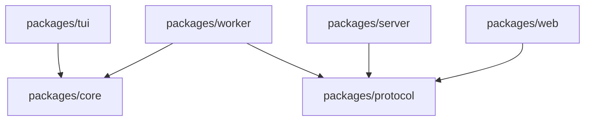
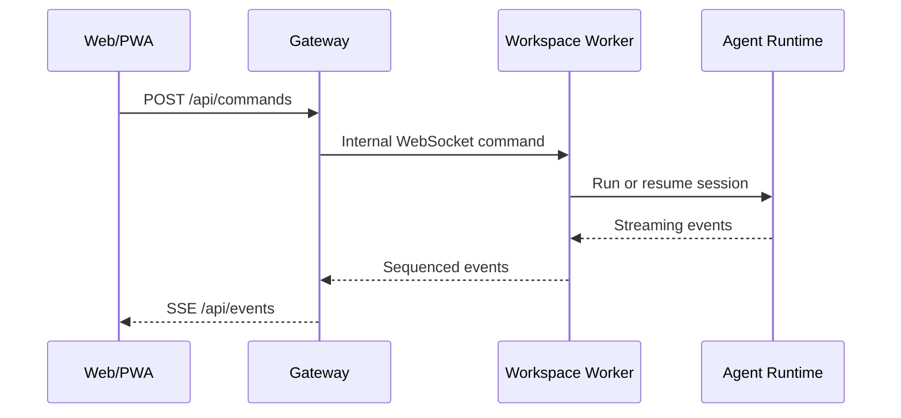

# Kross 技术概览

Kross 是本地优先的 TypeScript 编程 Agent。Core 提供与界面无关的运行时，TUI
直接在本机消费 Core；Cloud Worker 在容器内消费同一个 Core，Web 通过 Gateway
与 Worker 通信。

本文只描述当前实现和长期架构边界。安装、配置与命令用法分别见
[快速上手](getting-started.md)、[配置参考](configuration.md)和
[命令手册](command-reference.md)。

## 包与依赖方向

| Workspace | 职责 |
|---|---|
| `packages/core` | Runtime、上下文、会话、工具、权限、Skills、MCP、模型与验证 |
| `packages/tui` | Ink 终端交互与本地 Runtime 宿主 |
| `packages/protocol` | Cloud 命令、事件、回放与快照的 Zod 线协议 |
| `packages/server` | 认证、SSE/HTTP Gateway、工作区注册与 Docker 编排 |
| `packages/worker` | 工作区容器内的 headless Runtime 宿主 |
| `packages/web` | React/Vite Web 与 PWA 客户端 |

Core 不依赖任何界面或 Cloud 包。Protocol 不依赖 Core，并且只包含浏览器安全的
schema 与类型。产品包之间不得通过穿越目录的相对路径耦合。

## Runtime 组合

`packages/core/src/host/createAgentHost.ts` 是默认组合根，主要通过
`bootstrapRuntimeTooling` 与 `createRuntimeOptionsFromEnv` 创建：

- 模型客户端与上下文策略；
- Tool Gateway 与内置工具；
- workspace roots、Project Instructions 和 Skills；
- trace、Todo、mutation journal 与后台进程；
- MCP 客户端和子代理执行器。

`AgentRuntime` 是运行门面，具体职责分别下沉到会话服务、模型会话、模式流程、
工具循环、Checkpoint 和完成门。TUI 与 Worker 都复用这套组合，不维护独立 Agent
实现。

源码级扩展入口及稳定性说明见[扩展 Kross](extensions.md)。

## 模式与运行闭环

三种模式只决定工作策略，不拥有各自的输出管线：

- `auto`：直接探索、实施和验证，必要时可选择计划或编排。
- `plan`：先生成计划，用户批准后进入同一个主 Agent 工具循环。
- `conductor`：高级模型拆分任务，worker 在隔离上下文执行，最后读取真实 diff
  进行统一验收。

用户可见回复统一通过流式事件输出。一次运行会经过探索、计划、执行、验证、复核
与完成等可观测阶段，阶段由真实生命周期和工具事件推导，不依赖模型自行声明。

Harness 对验证、完成门、子代理复核与恢复不变量的详细说明见
[Agent Harness](harness.md)。

## 上下文系统

`ConversationThread` 是模型对话的单一事实源。用户消息、assistant 回复、
tool calls、工具结果和压缩摘要都写入 Thread；UI 消息和治理后的 Thread
Checkpoint 同时持久化。

请求前的上下文治理分为三层：

1. 老化超预算的历史工具输出，保留工具消息结构。
2. 把较早历史滚动压缩成唯一摘要，保留最近完整轮次。
3. 对无法通过前两层处理的单条超大消息执行 head/tail 硬截断。

输入预算由模型上下文窗口减去输出预留得到，使用模型返回的 usage 校准启发式
token 估算。`/context` 展示预算、来源和治理记录，`/compact` 手动触发滚动压缩。

固定上下文来源包括 Project Instructions、会话 Todo 和 Skills metadata：

- 每个授权 root 加载顶层 `CLAUDE.md`、`AGENTS.md`、`KROSS.md`；
- 个人 Skill 位于 `~/.kross/skills`，项目 Skill 位于
  `<workspace>/.agents/skills`；
- Skill 正文和资源通过 `ReadSkill` 按需读取，不常驻上下文；
- 子代理只接收个人规则和当前执行 root 的项目规则，避免跨仓库污染。

所有文件来源都经过 canonical path 校验、大小限制和 UTF-8 检查。

## 工具系统

Tool Gateway 是模型能力与真实副作用之间的边界。每个工具必须声明：

- 名称、描述与输入 Zod schema；
- `read`、`write`、`execute` 或 `network` 风险；
- 执行、超时、取消、摘要和可选 trace 脱敏逻辑。

默认权限策略自动允许只读工具，其他风险要求用户批准。调用前再次校验输入和动态
风险，调用结果及审批状态写入 trace。

连续、独立且无需审批的 read 调用最多 4 个并发，并按原始 tool-call 顺序回填；
write、execute、network、Process、MCP 与动态风险调用保持串行屏障。

内置工具覆盖文件、搜索、Git、Shell、后台进程、Todo、Skills、子代理与模式切换。
文件工具使用真实路径限制 workspace；所有 mutation 工具记录 pre/post image，
`/undo` 只在当前文件仍匹配 post hash 时恢复，避免覆盖后续人工修改。

`Bash` 和后台进程没有 OS 级沙箱。workspace cwd、权限审批和容器隔离的具体安全
边界见[安全模型](security.md)。

## Harness 与子代理

完成状态不由模型的最终文本单独决定：

- Stall Guard 检测重复工具调用和无进展结果；
- Verification Report 从真实 test、typecheck、build 和 lint trace 汇总证据；
- 发生 mutation 后，只接受最后一次修改之后完成的验证；
- 验证失败或无法执行可以结束运行，但必须保留失败或未运行状态；
- Conductor worker 只有在能够证明没有修改时才允许安全重试；
- 最终 reviewer 读取各 root 的 Git status 和真实 diff 后给出 verdict。

`Task` 子代理使用独立上下文、受限工具集和最大深度。子代理工具事件带作用域标记，
不会混入主会话工具历史。

## 持久化与恢复

本地运行数据默认位于 `~/.kross`：

| 数据 | 设计 |
|---|---|
| 会话 | append-only JSONL 事实源，SQLite 仅作为可重建索引 |
| Thread | 随会话保存的模型上下文 Checkpoint |
| Work State | Todo、模式、待确认计划和版本化运行 Checkpoint |
| Trace | JSONL 工具与生命周期事件 |
| Mutation | JSONL 元数据与 content-addressed blobs |

等待审批时，open turn 与运行 Checkpoint 一起保存。恢复前会核对 tool call、已有
结果、当前工具定义、动态风险和审批策略。只有明确尚未执行的审批调用可以续跑；
已完成的写入或执行绝不会猜测性重放。证据不完整时恢复路径 fail-closed。

Cloud 会话和工作区状态保存在对应 Docker volume 中，Gateway 只保存工作区注册与
控制面数据。生命周期、备份边界和容器恢复见
[Cloud Agent 部署与运维](cloud-agent-deployment.md)。

## Cloud 数据流

浏览器上行使用 HTTP POST，下行使用 SSE；Gateway 与 Worker 的内部连接使用
WebSocket。客户端通过 `requestId` 保证命令幂等，通过事件 `seq` 恢复和去重。
Protocol schema 是 Web、Gateway 与 Worker 的共享边界。

每个工作区使用独立 Worker、Docker volume 和 bridge 网络。Web 静态文件由独立
Nginx 容器提供，Gateway 不包含前端产物，因此前后端可以分别构建和发布。

## 当前限制

- 本地 `Bash` 与后台进程没有 OS 级沙箱。
- MCP 当前只支持 stdio tools，不支持 HTTP transport、resources 和 prompts。
- 没有跨会话语义记忆。
- Project Instructions 只加载 workspace root 顶层。
- `packages/core` 与 `packages/protocol` 尚未作为稳定 SDK 单独发布。
- Cloud 的 Docker、移动端、弱网、Push 与 Git 凭证流程仍需社区持续验证。
