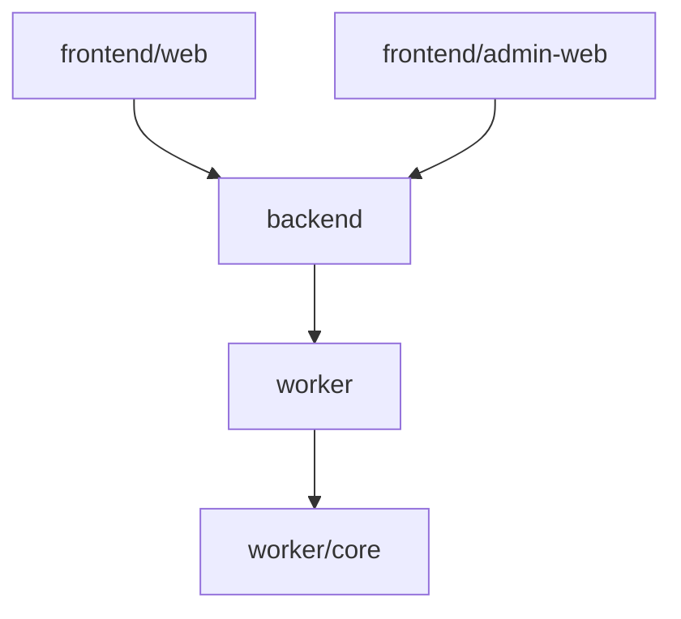
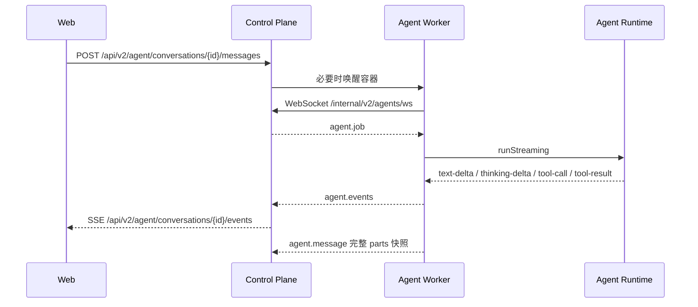

# Kross 技术概览

Kross 是面向自托管部署的 Cloud 编程 Agent。`worker/core` 提供运行时，
`worker` 在每位成员的持久 Docker 工作区里执行；Web 只通过 Java 后端收发消息，
浏览器不直连 Worker。

本文只描述当前实现和长期架构边界。安装与配置见
[快速上手](getting-started.md)和[配置参考](configuration.md)。

## 目录与依赖方向

```mermaid
flowchart TB
    WEB["frontend/web"] --> BACKEND["backend"]
    ADMIN["frontend/admin-web"] --> BACKEND
    BACKEND --> WORKER["worker"]
    WORKER --> CORE["worker/core"]
```

| 路径 | 职责 |
|---|---|
| `frontend/web` | 普通用户工作台 |
| `frontend/admin-web` | 组织管理端 |
| `backend` | Java Spring Boot 控制面（身份、模型、Agent 生命周期） |
| `worker` | 个人 Agent 容器内的常驻 Runtime 宿主 |
| `worker/core` | Runtime、上下文、会话、工具、权限、Skills、MCP、模型与验证 |

Core 不依赖 Web 或 Java 后端。浏览器不引用 Core。前后端通过 HTTP/SSE 交换消息；
Worker 只在容器运行时用 WebSocket 连控制面。

Core 顶层只由 `src/api/public.ts` 和 `src/api/experimental.ts` 组成；内部模块不
允许通过新的 `export *` 泄漏。`worker/core/api-surface.json` 保存包含类型导出
的稳定快照，`npm run api:check`（在 `worker/` 下）阻止未经分类的增删。

## Runtime 组合

`createAgentHost` 是默认组合根。它一次性创建并拥有：

- 模型客户端与上下文策略；
- Tool Gateway 与内置工具；
- workspace roots、Project Instructions 和 Skills；
- trace、Todo、mutation journal 与后台进程；
- MCP 客户端和子代理执行器。

Host 可以在同一组 Tooling 资源上创建替换用的 `AgentRuntime`，并通过幂等
`close()` 统一释放 MCP、后台进程和 trace。调用方仍拥有当前运行的
`AbortController`，必须先取消前台运行，再关闭 Host。Cloud Worker 为每个活跃
会话创建独立 Host，保持会话之间的工具、trace 和运行状态隔离。

`createAgentHost` 还提供 experimental lifecycle hooks。它们在共享
`ObservableTraceStore` 边界接收冻结后的脱敏通知，因此同一 Host 重建 Runtime
不会重复订阅，也能覆盖 Runtime 与 Tool Gateway 产生的生命周期事件。调度器采用
异步通知、单 Hook 超时、pending 上限和事件速率限制，不参与 Agent 决策。

`AgentRuntime` 是运行门面，负责 run、resume、approval 和 cancel 语义，具体职责
分别下沉到会话服务、模型会话、模式流程、工具循环、Checkpoint 和完成门。Worker
宿主只组合和驱动 Runtime，不维护独立 Agent 实现。需要更底层组装时仍可使用
experimental 的 `bootstrapRuntimeTooling` 与 `createRuntimeOptionsFromEnv`。

源码级扩展入口及稳定性说明见[扩展 Kross](extensions.md)。

## 模式与运行闭环

三种模式只决定工作策略，不拥有各自的输出管线：

- `auto`：直接探索、实施和验证，必要时可选择计划或编排。
- `plan`：先生成计划，用户批准后进入同一个主 Agent 工具循环。
- `conductor`：高级模型拆分任务，worker 在隔离上下文执行，最后读取真实 diff
  进行统一验收。

用户可见回复统一通过流式事件输出。一次运行会经过探索、计划、执行、验证、复核
与完成等可观测阶段，阶段由真实生命周期和工具事件推导，不依赖模型自行声明。

Harness 对验证、完成门、子代理复核与恢复不变量的详细说明见
[Agent Harness](harness.md)。

## 上下文系统

`ConversationThread` 是模型对话的单一事实源。用户消息、assistant 回复、
tool calls、工具结果和压缩摘要都写入 Thread；UI 消息和治理后的 Thread
Checkpoint 同时持久化。

请求前的上下文治理分为三层：

1. 老化超预算的历史工具输出，保留工具消息结构。
2. 把较早历史滚动压缩成唯一摘要，保留最近完整轮次。
3. 对无法通过前两层处理的单条超大消息执行 head/tail 硬截断。

输入预算由模型上下文窗口减去输出预留得到，使用模型返回的 usage 校准启发式
token 估算。`/context` 展示预算、来源和治理记录，`/compact` 手动触发滚动压缩。

固定上下文来源包括 Project Instructions、会话 Todo 和 Skills metadata：

- 每个授权 root 加载顶层 `CLAUDE.md`、`AGENTS.md`、`KROSS.md`；
- 个人 Skill 位于 `~/.kross/skills`，项目 Skill 位于
  `<workspace>/.agents/skills`；
- Skill 正文和资源通过 `ReadSkill` 按需读取，不常驻上下文；
- 子代理只接收个人规则和当前执行 root 的项目规则，避免跨仓库污染。

所有文件来源都经过 canonical path 校验、大小限制和 UTF-8 检查。

## 工具系统

Tool Gateway 是模型能力与真实副作用之间的边界。每个工具必须声明：

- 名称、描述与输入 Zod schema；
- `read`、`write`、`execute` 或 `network` 风险；
- 执行、超时、取消、摘要和可选 trace 脱敏逻辑。

`default` 自动允许当前 workspace 内的只读工具，其他风险请求人工审批；
`classifier` 自动允许 workspace 内可信读写，Shell 与网络继续审批；`auto`
是完全访问模式，解除内建文件、搜索、
Git 与 Shell cwd 的 workspace 路径边界。权限模式随 Work State 持久化；调用前
仍会校验动态风险，调用结果及审批状态写入 trace。

连续、独立且无需审批的 read 调用最多 4 个并发，并按原始 tool-call 顺序回填；
write、execute、network、Process、MCP 与动态风险调用保持串行屏障。

内置工具覆盖文件、搜索、Git、Shell、后台进程、Todo、Skills、子代理与模式切换。
文件工具使用真实路径限制 workspace；所有 mutation 工具记录 pre/post image，
`/undo` 只在当前文件仍匹配 post hash 时恢复，避免覆盖后续人工修改。

MCP 协议客户端通过 Transport 契约使用 JSON-RPC；Transport 负责连接、取消、
超时、诊断和关闭，协议客户端负责 initialize、capability、tools、resources 与
prompts 调用。stdio
和 Streamable HTTP 共用这一生命周期；HTTP 额外维护 session、JSON/SSE 响应、
cursor 恢复和协议版本 header。所有 MCP 工具仍经过同一 Gateway 权限边界。
`/mcp reload` 会先在隔离 Gateway 中准备新连接和工具，全部成功后原子切换；
旧连接在已有调用排空后关闭，刷新失败则保留当前 generation。Resources 只有在
用户执行 `/mcp resource` 后才作为带 server/URI 来源的外部
Context Source 加入当前会话；Prompts 仅通过 `/mcp prompt` 预览，不会静默改变
系统行为。

Cloud Worker 的 `Bash` 和后台进程运行在独立容器内。具体安全边界见
[安全模型](security.md)。

## Harness 与子代理

完成状态不由模型的最终文本单独决定：

- Stall Guard 检测重复工具调用和无进展结果；
- Verification Report 从真实 test、typecheck、build 和 lint trace 汇总证据；
- 发生 mutation 后，只接受最后一次修改之后完成的验证；
- 验证失败或无法执行可以结束运行，但必须保留失败或未运行状态；
- Conductor worker 只有在能够证明没有修改时才允许安全重试；
- 最终 reviewer 读取各 root 的 Git status 和真实 diff 后给出 verdict。

`Task` 子代理使用独立上下文、受限工具集和最大深度，并可通过
`modelProfileId` 选择已配置的模型档案；未指定时继承当前模型。子代理工具事件带作用域标记，
不会混入主会话工具历史。

## 持久化与恢复

本地运行数据默认位于 `~/.kross`：

| 数据 | 设计 |
|---|---|
| 会话 | append-only JSONL 事实源，SQLite 仅作为可重建索引 |
| Thread | 随会话保存的模型上下文 Checkpoint |
| Work State | Todo、模式、待确认计划和版本化运行 Checkpoint |
| Trace | JSONL 工具与生命周期事件 |
| Mutation | JSONL 元数据与 content-addressed blobs |

等待审批时，open turn 与运行 Checkpoint 一起保存。恢复前会核对 tool call、已有
结果、当前工具定义、动态风险和审批策略。只有明确尚未执行的审批调用可以续跑；
已完成的写入或执行绝不会猜测性重放。证据不完整时恢复路径 fail-closed。

Trace Replay 与运行恢复是两条不同路径。`/trace replay <runId>` 只读取事件并生成
版本化状态帧和汇总，不调用 LLM、Tool Gateway、Git 或外部系统。它要求事件来自
同一 run、ID 唯一、时间单调、类型已知、以 `run.started` 开始且终态后无追加；
可关联的工具终态必须有对应 start。缺失、乱序和未知事件返回稳定错误码，供
Cloud 检查面板使用。

Cloud 会话权威记录保存在控制面 PostgreSQL；Worker 卷保存 `/work` 工作区文件。
生命周期、备份边界和容器恢复见
[Cloud Agent 部署与运维](cloud-agent-deployment.md)。

## Cloud 数据流

```mermaid
sequenceDiagram
    participant B as Web
    participant CP as Control Plane
    participant W as Agent Worker
    participant R as Agent Runtime

    B->>CP: POST /api/v2/agent/conversations/{id}/messages
    CP->>W: 必要时唤醒容器
    W->>CP: WebSocket /internal/v2/agents/ws
    CP-->>W: agent.job
    W->>R: runStreaming
    R-->>W: text-delta / thinking-delta / tool-call / tool-result
    W-->>CP: agent.events
    CP-->>B: SSE /api/v2/agent/conversations/{id}/events
    W-->>CP: agent.message 完整 parts 快照
```

浏览器上行使用 HTTP POST，下行使用 SSE；控制面把通用 `parts` 存在 PostgreSQL，
直播事件只在内存扇出，不把每个 token 写入数据库。Worker 只在容器运行时与控制面
保持 WebSocket：空闲时由控制面推送任务，生成过程立即推送 delta。浏览器不直连
Worker。版本、错误和回放语义见 [Cloud Protocol](cloud-protocol.md)。

每个成员使用独立 Agent 容器和 Docker volume。Web 静态文件由独立
Nginx 容器提供。

## 当前限制

- Cloud Worker 的 `Bash` 与后台进程使用容器内 `node` 用户权限，执行前依赖权限审批。
- MCP 尚不支持交互式 OAuth。
- 没有跨会话语义记忆。
- Project Instructions 只加载 workspace root 顶层。
- Core 尚未作为稳定 SDK 单独发布。
- Cloud 的 Docker、移动端、弱网、Push 与 Git 凭证流程仍需社区持续验证。
