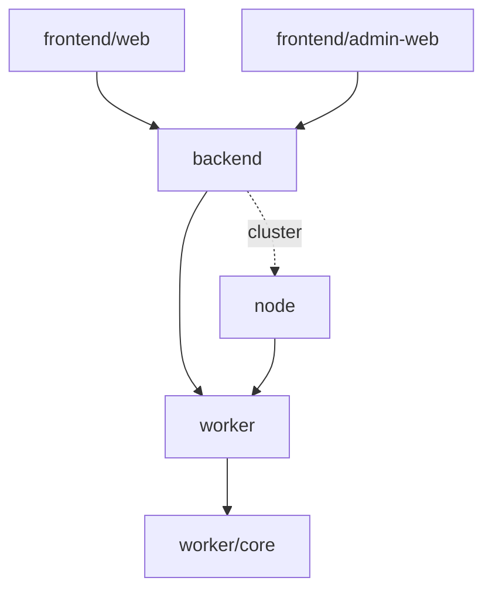
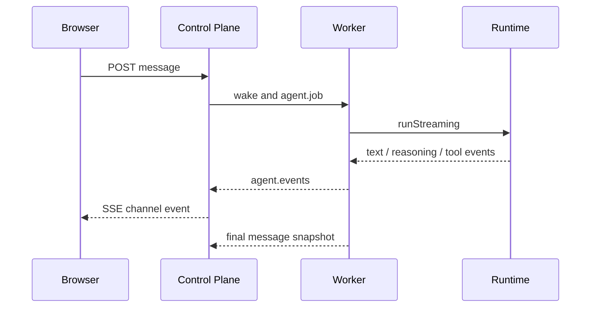

# Kross 技术概览

Kross 是面向组织的 SaaS Work Agent。控制面拥有身份与持久化，容器 Worker 拥有执行环境，浏览器只与控制面通信。

## 组件与依赖

```mermaid
flowchart TB
    WEB["frontend/web"] --> BACKEND["backend"]
    ADMIN["frontend/admin-web"] --> BACKEND
    BACKEND --> WORKER["worker"]
    BACKEND -. cluster .-> NODE["node"]
    NODE --> WORKER
    WORKER --> CORE["worker/core"]
```

| 组件 | 职责 |
|---|---|
| `frontend/web` | 对话、Skill、记忆、文件与产物 |
| `frontend/admin-web` | 平台模型、组织、成员、Skill 包和基础设施管理 |
| `backend` | 身份、数据、SSE、Worker 租约与容器生命周期 |
| `node` | 多机部署时在目标节点启动 Worker |
| `worker` | 成员容器中的控制面协议适配与会话宿主 |
| `worker/core` | SaaS Runtime、上下文、工具、子任务与恢复 |

依赖方向保持单向：Web 不引用 Core，Core 不依赖 Java 或 UI。

## 唯一 Runtime

每个会话使用同一套自动工作闭环。Runtime 根据用户目标直接回答或调用工具，不读取用户选择的运行模式。用户要求“先给方案”只是普通语言约束，不生成特殊模式状态。

系统上下文由以下受管来源组成：

- SaaS Work Agent 基础行为；
- 控制面下发的 `USER.md` 与 `MEMORY.md`；
- 会话启动时固定的版本化 Skill；
- 当前 Todo 和实时工具边界。

其他 `/work` 文件是待处理资料，不会因为文件名而自动成为系统指令。

## 工具边界

默认内置工具只有：

- 文件：Read、Write、Edit、Delete、Move；
- 检索：Glob、Grep、Rg、List、Stat；
- 工作管理：TodoRead、TodoWrite；
- 受限子任务：Task。

Runtime 不注册 Shell、Git、Patch、后台进程或代码验证工具。Task 子任务最多一层，使用同一工作区和 Skill；调查子任务只读，执行子任务只额外获得 Write/Edit。

受管外部工具可以由平台连接，但仍通过 Tool Gateway。工作区 read/write 自动允许；network 和未知副作用要求确认。调度器只并发独立只读调用，写入与外部调用保持有序。

## 结果与恢复

最终结果包含：

- `artifacts`：创建或修改的工作产物；
- `evidence`：完成依据；
- `incompleteItems`：明确未完成部分。

完成门只要求产生真实用户回复，不把 Git 状态、测试或构建当作所有工作的通用成功条件。Stall Guard 会在重复调用无进展时先提示恢复，再有限停止。

等待外部工具确认时，Runtime 保存 open turn 和 checkpoint。恢复前重新核对 tool-call、已有结果、当前定义和实时策略；只有确定尚未执行的调用可以继续，任何已完成副作用都不会重放。

## Cloud 数据流

```mermaid
sequenceDiagram
    participant B as Browser
    participant C as Control Plane
    participant W as Worker
    participant R as Runtime
    B->>C: POST message
    C->>W: wake and agent.job
    W->>R: runStreaming
    R-->>W: text / reasoning / tool events
    W-->>C: agent.events
    C-->>B: SSE channel event
    W-->>C: final message snapshot
```

对话与最终 `parts` 在 PostgreSQL；Token delta 只做内存扇出。工作区文件位于 `/work`。单机使用 Docker volume，多机可使用 JuiceFS。

## 当前边界

- Worker Core 仍是内部源码，不是稳定 SDK。
- 受管外部工具尚不支持所有交互式 OAuth 流程。
- 浏览器附件上传仍需独立协议；当前文件面板提供目录浏览和文本预览。
- 生产环境仍需在真实 TLS、弱网、移动端和备份恢复场景验收。
